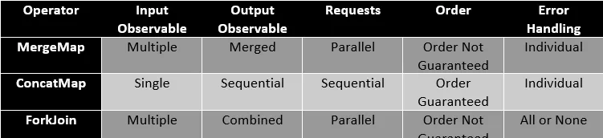
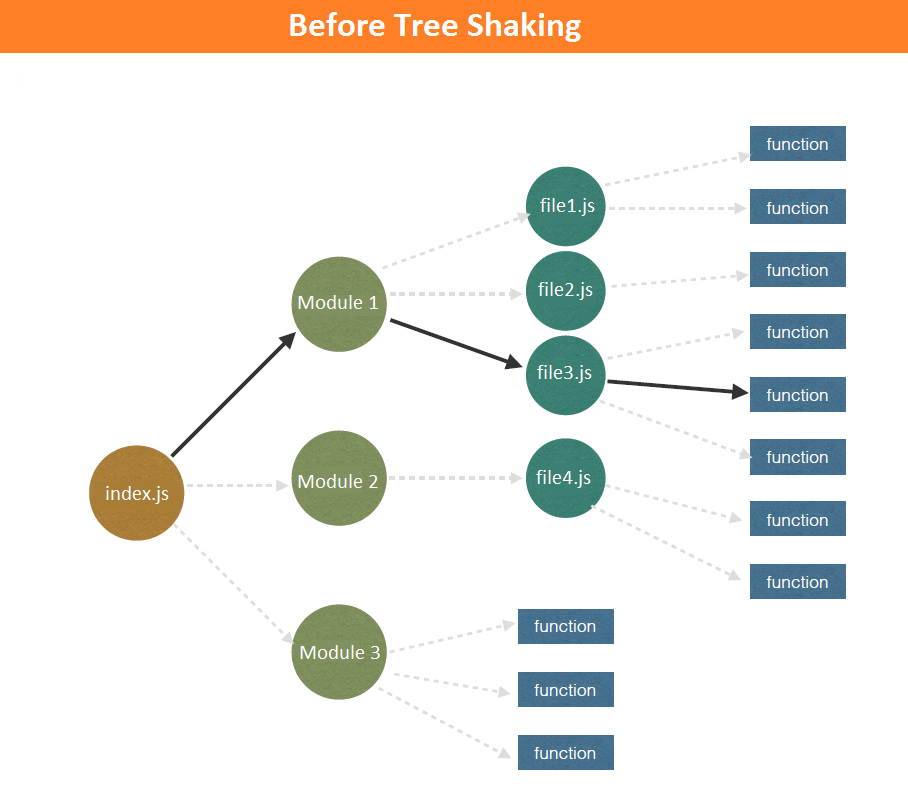
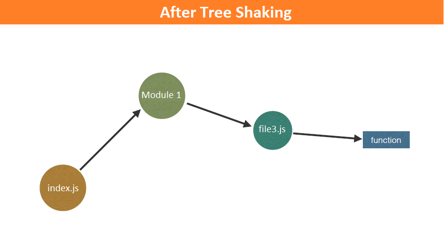
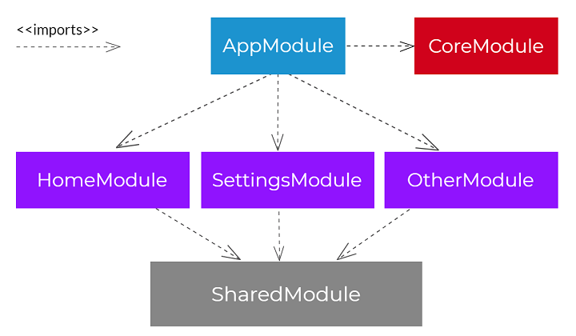

## Interview questions from Angular 16 to 19 versions

<details>

<summary><strong>Angular HTTP Caching for Server-Side Rendering (SSR)</strong></summary>

### What is Angular SSR HTTP Caching?
Ans. Angular provides built-in HTTP caching for Server-Side Rendering (SSR) using the withHttpTransferCache() function as part of its hydration process. This mechanism automatically transfers data fetched on the server to the client, preventing duplicate API calls and improving performance. 
Angular SSR HTTP caching uses TransferState to reuse server-fetched HTTP responses during browser hydration, preventing duplicate API calls and improving performance.
**This works only when the component is rendered during SSR.**
**If the API response depends on headers, it must not use Angular SSR transfer cache.**

### How Angular SSR HTTP Caching Works?
  -  Server-side Fetching: When the Angular application is rendered on the server, the HttpClient intercepts and executes the necessary HTTP requests (by default, all GET and HEAD requests that don't have Authorization or Proxy-Authorization headers).
  -  Data Serialization: The responses to these requests are automatically cached and serialized into a JSON format using Angular's TransferState API. This data is then embedded within the initial HTML payload sent to the browser.
  -  Client-side Reuse: In the browser, during the hydration process, the HttpClient checks this cache. If a matching cached response is found, it reuses the data instead of initiating a new network request.
  -  Cache Invalidation: Once the application becomes fully stable and interactive in the browser, the HttpClient stops using this transfer cache and reverts to normal behavior (making fresh network calls). 
| Piece               | Role                                       |
| ------------------- | ------------------------------------------ |
| `HttpClient`        | Makes HTTP calls                           |
| `HttpTransferCache` | Transfers server HTTP responses to browser |
| Node.js SSR server  | Executes Angular app                       |
| Browser             | Reuses cached responses after hydration    |
| Backend API         | Actual data source                         |

### High-level flow (step by step)
1. Browser requests a page
2. Angular SSR server boots the app
3. Components/services make HttpClient calls
4. Server:
  -  Fetches data from APIs
  -  Stores responses in TransferState
5. Server sends:
  -  Rendered HTML
  -  Serialized HTTP cache
6. Browser:
  -  Hydrates Angular
  -  Reuses cached HTTP responses
  -  ❌ No duplicate API calls

### SSR Cache vs Browser HTTP Cache
| SSR Transfer Cache         | Browser HTTP Cache   |
| -------------------------- | -------------------- |
| In-memory                  | Disk / memory        |
| Per request                | Persistent           |
| Avoids duplicate SSR calls | Avoids network calls |
| Angular-managed            | Browser-managed      |

### Where caching actually happens
✅ Cached
  -  GET requests
  -  Requests without side effects
  -  Requests executed during SSR render
❌ Not cached by default
  -  POST, PUT, DELETE
  -  Requests with changing headers (auth tokens, cookies)
  -  Deferred components (@defer)
  -  Requests made after hydration

### What breaks when headers / queryParams change
| Change                   | Cache behavior | Defect            |
| ------------------------ | -------------- | ----------------- |
| QueryParams change       | New cache key  | ✅ Safe            |
| QueryParams order change | New cache key  | ⚠ Duplicate calls |
| Auth header change       | Same cache key | 🔴 Data leak      |
| Tenant header change     | Same cache key | 🔴 Wrong tenant   |
| Locale header change     | Same cache key | 🔴 Wrong language |
| ETag / If-None-Match     | Ignored        | 🔴 Stale data     |
| Cookies                  | Ignored        | 🔴 User mix-up    |

### Why Angular disables caching for @defer
**Deferred components:**
  -  Render after initial HTML
  -  Often run only in browser
  -  Data may be user-specific or dynamic
**➡️ Caching them during SSR would cause:**
  -  Incorrect data
  -  Memory leaks
  -  Stale responses
That’s why HttpTransferCache is skipped for deferred blocks

### Why is SSR used in Banking applications?
Answer: SSR is used mainly for performance, SEO, and perceived speed, not for real-time financial data.

In banking apps, SSR:
  -  Improves TTFB for public and semi-public pages
  -  Ensures consistent first paint
  -  Helps SEO and compliance pages
  -  Provides a fast application shell

However, critical financial data is never trusted from SSR.

### What data should NEVER be SSR-cached in Banking?
Answer: Any user-specific or time-sensitive data must not be cached.

Examples:
  -  Account balances
  -  Transactions
  -  Market prices
  -  Trade orders
  -  Authentication tokens

Caching such data risks:
  -  Data leakage
  -  Stale financial information
  -  Regulatory violations

### How does Angular prevent duplicate API calls between SSR and browser?
Answer: Angular uses HttpTransferCache (TransferState).

Flow:
  -  HTTP call runs on the server
  -  Response is stored in TransferState
  -  During hydration, the browser reuses it
  -  No second network call is made
This is safe only for idempotent, public GET requests.

### Why are real-time components excluded from SSR?
Answer:
**Because real-time data:**
  -  Changes continuously
  -  Depends on authenticated sessions
  -  Uses WebSocket/SSE
  -  Must reflect the current state only
**SSR would:**
  -  Render stale data
  -  Create invalid streams
  -  Increase server load
Hence, real-time components are client-only using @defer.

### How do you combine SSR with real-time streaming?
Answer: By using a hybrid rendering model:
  -  SSR renders:
      -  App shell
      -  Layout
      -  Static reference data
  -  Browser:
      -  Authenticates user
      -  Opens real-time streams
      -  Replaces placeholders
This ensures freshness without sacrificing performance.

### What role does @defer play in Banking SSR?
Answer: 
**@defer ensures:**
  -  Sensitive components are not rendered on the server
  -  Heavy components load after hydration
  -  Real-time widgets initialize only in browser
**It is essential for:**
  -  Dashboards
  -  Live charts
  -  Streaming tickers

### How do you prevent SSR data leakage between users?
Answer: By enforcing request isolation:
  -  One SSR render per request
  -  No shared in-memory caches
  -  No global singleton state
  -  Short-lived SSR context
In banking, SSR must be stateless.

### What SSR caching strategy do you recommend for Banking apps?
Answer:
| Data Type             | Strategy            |
| --------------------- | ------------------- |
| Public content        | SSR + TransferCache |
| Static reference data | SSR cached          |
| User metadata         | SSR, no cache       |
| Financial data        | Client only         |
| Market data           | Streaming           |
This avoids both stale data and security risks.

### Why not rely on browser HTTP cache instead of SSR cache?
Answer:
**Browser cache:**
  -  Is persistent
  -  Can be reused across users (shared devices)
  -  Harder to control securely

**SSR TransferState:**
  -  Exists per request
  -  Is destroyed after hydration
  -  Fully controlled by Angular
For banking, SSR cache is safer.

### How does Angular Signals help SSR + Real-Time apps?
Answer:
Signals:
  -  Provide synchronous state updates
  -  Work seamlessly after hydration
  -  Replace RxJS-heavy stores for live data

They are ideal for:
  -  Streaming updates
  -  Fine-grained UI refresh
  -  Real-time dashboards

### What happens if SSR fails in production?
Answer: A banking-grade app must:
  -  Gracefully fall back to CSR
  -  Never block user access
  -  Log SSR failures centrally
SSR is a performance optimization, not a dependency.

### What is the biggest mistake teams make with SSR in Banking?
Answer: Trying to SSR everything.
**This leads to:**
  -  Stale balances
  -  Data leaks
  -  Performance degradation
  -  Regulatory risks
Correct approach: Selective SSR only.

### How would you explain Banking SSR in one sentence?
Answer: SSR in banking apps renders structure and static data for speed, while all sensitive and real-time financial data is loaded client-side to ensure security and correctness.

### What SSR should and should NOT do
**✅ SSR SHOULD handle**
  -  Public / semi-public pages
  -  Static reference data
  -  Layout & shell rendering
  -  SEO pages (marketing, product info)

**❌ SSR SHOULD NOT handle**
  -  Live balances
  -  Orders / trades
  -  Streaming prices
  -  User-specific secrets

### How Banking / Real-Time App use SSR Strategy ?
Ans. Banking systems are not normal content websites. SSR must be selective, not aggressive. 
In banking real-time apps, Angular SSR is used only for shell and static data, while user-specific and live financial data is loaded client-side using deferred rendering and streaming to guarantee freshness and security.

**🟢 SSR Cacheable (Safe)**
  -  Bank products
  -  Exchange holidays
  -  Static limits
  -  Reference master data
➡️ Use HttpTransferCache

**🟡 SSR Rendered but NOT Cached**
  -  User profile (name only)
  -  Last login timestamp
  -  Account list metadata
➡️ Use SSR fetch without TransferState

**🔴 Client-Only (Real-Time)**
  -  Account balances
  -  Market prices
  -  Trade status
  -  Notifications
➡️ Load via:
  -  @defer
  -  WebSocket / SSE
  -  Signals

**Recommended stack**
| Layer     | Technology              |
| --------- | ----------------------- |
| Transport | WebSocket / SSE         |
| State     | Signals                 |
| Streaming | Lightstreamer / AppSync |
| Fallback  | REST polling            |
| Security  | Short-lived JWT         |

### Which components of an application should and should not use SSR Cache
| Area        | Strategy                   |
| ----------- | -------------------------- |
| Market open | Disable SSR for dashboards |
| SEO pages   | Full SSR                   |
| Dashboards  | Hybrid                     |
| Charts      | Client only                |
| Tables      | SSR skeleton               |

### Would you SSR a trading dashboard?
Ans. Only the shell and layout. Charts, prices, and trades are client-only and streaming-based.

### Can SSR be used for real-time stock prices?
Ans. No. Real-time prices:
  -  Change continuously
  -  Require live streams
  -  Must reflect current user session
SSR is unsuitable; use WebSocket/SSE after hydration.

### Is TransferState the same as browser cache?
Ans. No.
| TransferState      | Browser Cache            |
| ------------------ | ------------------------ |
| Per SSR request    | Persistent               |
| In-memory          | Disk/memory              |
| Angular-controlled | Browser-controlled       |
| Safer for banking  | Risky for sensitive data |

### Does SSR reduce backend load?
Ans. SSR often increases backend load because:
  -  Servers execute HTTP calls
  -  Rendering happens per request
SSR improves perceived performance, not backend efficiency.

### Can SSR cache authenticated API responses?
Ans. Generally no. 
Authenticated responses:
  -  Are user-specific
  -  Risk accidental reuse
  -  Increase memory footprint
Best practice: Client-only fetch after hydration.

### What happens if SSR HTML and client data differ?
Ans. Angular may:
  -  Throw hydration warnings
  -  Drop DOM reuse
  -  Fall back to CSR
In banking, hydration mismatch = critical defect.

### Is SSR mandatory for SEO in banking?
Ans. Only for:
  -  Marketing pages
  -  Public product pages
  -  Compliance content
Logged-in dashboards do not need SEO SSR.

### Can WebSockets run during SSR?
Ans. Technically yes, architecturally no.
SSR must be:
  -  Stateless
  -  Short-lived
  -  Request-scoped
Streaming belongs to the browser only.

### Is SSR a security feature?
Ans. No. SSR can increase risk if misused.
Security depends on:
  -  Proper cache isolation
  -  No shared memory
  -  Strict data classification

### What’s the biggest SSR risk in finance apps?
Ans. Incorrect caching of sensitive data leading to:
  -  Data leaks
  -  Regulatory violations
  -  Financial loss

### Should each microfrontend have its own SSR?
Ans. It depends.
| Scenario       | SSR Strategy |
| -------------- | ------------ |
| Shell / Host   | SSR          |
| Marketing MFEs | SSR          |
| Trading MFEs   | CSR only     |
| Admin tools    | CSR          |
**Most banking platforms use SSR at shell level only.**

### How do you prevent SSR cache leaks across MFEs?
Ans. 
-  Isolate TransferState per MFE
-  No shared in-memory stores
-  No global singletons
-  One SSR request = one render tree

### Can multiple MFEs share HTTP TransferCache?
Ans. No. Each MFE must:
  -  Control its own caching
  -  Disable transfer cache for sensitive data

### How do MFEs hydrate independently?
Ans.
  -  Shell hydrates first
  -  MFEs hydrate lazily
  -  Real-time MFEs use @defer
This avoids blocking the main app.

### SSR in Module Federation – good or bad?
Ans. Advanced and risky.
**Pros:**
  -  Faster first paint
**Cons:**
  -  Version mismatch
  -  Cache poisoning risk
  -  Complex deployments
Used only for static MFEs.

### How do you handle auth in SSR MFEs?
Ans. 
  -  SSR sees only anonymous context
  -  Auth happens in browser
  -  Tokens never stored in SSR memory

### What happens if one MFE SSR fails?
Ans. 
  -  Shell renders
  -  Failed MFE falls back to CSR
  -  User is not blocked
Failure isolation is mandatory.

### Can MFEs share real-time connections?
Ans. Yes — but client-side only.
**Use:**
  -  Shared WebSocket service
  -  Event bus / Signals
  -  No SSR involvement


</details>

<details>

<summary><strong>Angular Micro frontend</strong></summary>

### What is Micro frontend?
Ans. Micro frontends are a way of designing  frontend web applications by breaking them into smaller, independent, and  self-contained modules or "mini-apps." Each micro frontend can be built, tested,  and deployed separately by different teams, and they can even use different  technologies or frameworks. These individual frontends are then combined to  create the full user interface of the application.

### Why needs Micro frontend ?
As our applications grow in size and complexity, maintaining a monolithic frontend  becomes increasingly difficult. Micro frontends offer a powerful solution to break down the complexity and scale  your frontend architecture. So, because of Scalability, Maintainability,  Faster Development, Technology Diversity, and Code Reusability, using  micro frontends makes sense.

### What is Module Federation ?
Ans. Module Federation is a feature in Webpack 5  that lets different frontend apps or modules, built and deployed separately, share  and load code dynamically while running. It’s an important tool for creating Micro Frontends. Each remote app shares specific parts, like components or services, that the host app can use whenever needed without bundling everything upfront. Module Federation helps create  scalable micro frontend setups with faster releases and easier maintenance. Starting with Angular 13 and newer versions, using  Native Module Federation, mainly with libraries like @angular-architects/native-federation, brings many advantages over older Module Federation setups that depended  more on Webpack-specific settings.
https://www.youtube.com/watch?v=ZlJ__9bYHxs

</details>

<details>

<summary><strong>Angular Architectural Questions & Answers</strong></summary>

### What is Angular architecture?
Ans. Angular follows a component-based architecture where the UI is split into components, each with its own template, logic, and styles. These components are organized into a dependency-injection-based system and connected using routing, services, and reactive patterns (RxJS, Reactive Forms, Signals).

### What are standalone components? Why did Angular adopt them?
Ans. Standalone components remove NgModules. They make Angular more lightweight and modular. 
**Benefits:**
  -  Less boilerplate
  -  Tree-shakeable
  -  Faster build & better performance
  -  Simplified folder structure
  -  Clear and direct imports

### How does Change Detection work in Angular?
Ans. Angular runs change detection using zone.js (or zone-less mode), executing a check cycle to update DOM whenever model changes.
**Modes:**
  -  Default – checks entire tree
  -  OnPush – checks only for @Input change, event emission, or Observable async pipe change
  -  Signal-based reactivity (v16+) uses fine-grained reactivity

### How Many Dependency Injectors Does Angular Have?
Ans. Angular provides two main types of injectors:
```
                         ┌──────────────────────────┐
                         │      Null Injector       │
                         └────────────┬─────────────┘
                                      │
                         ┌────────────▼─────────────┐
                         │      Root Injector        │
                         │ (providedIn: 'root')      │
                         └────────────┬─────────────┘
                                      │
                       ┌──────────────┴──────────────┐
                       │                             │
        ┌──────────────▼──────────────┐   ┌──────────▼───────────┐
        │   Root Environment Injector  │   │   Router Env Injector│
        │ (bootstrapApplication())     │   │  (route-level DI)    │
        └──────────────┬──────────────┘   └──────────┬───────────┘
                       │                             │
                       │                  ┌──────────▼───────────┐
                       │                  │   Lazy Route Injector │
                       │                  │ (Lazy-loaded modules) │
                       │                  └──────────┬───────────┘
                       │                             │
         ┌─────────────▼─────────────┐   ┌───────────▼────────────┐
         │  Component Injectors       │   │ Component Injectors     │
         │ (providers/viewProviders) │   │ for Lazy Loaded Components│
         └─────────────┬─────────────┘   └───────────┬────────────┘
                       │                             │
             ┌─────────▼─────────┐          ┌────────▼─────────┐
             │ Directive Injectors│          │ Directive Injectors│
             └────────────────────┘          └────────────────────┘
```

**1. Module Injector (a.k.a. Root Injector)**
This is created when the application starts. It holds:
  -  Services provided in @Injectable({ providedIn: 'root' })
  -  Providers listed in AppModule or other NgModules
👉 There is exactly one root/module injector per Angular app.

**2. Element Injectors (a.k.a. Node/Component Injectors)**
Angular creates one injector for every component and directive instance if they have providers. Examples that create element injectors:
  -  providers: [...] in a component
  -  viewProviders: [...]
  -  providers on a directive
📌 So the number of element injectors = number of component/directive instances that define providers.
You may have hundreds or thousands of element injectors depending on the DOM.
```
@Component({
  selector: 'my-cmp',
  providers: [AService],
  viewProviders: [BService]
})

                            ┌─────────────────────┐
                            │  Parent Injector     │
                            └──────────┬───────────┘
                                       │
                     ┌─────────────────▼─────────────────┐
                     │     Component Injector             │
                     │  provides: AService               │
                     │  viewProviders: BService          │
                     └───────────────┬───────────────────┘
                                     │
               ┌─────────────────────▼─────────────────────┐
               │ Directive Injectors inside template        │
               │ (can access AService but not BService)     │
               └────────────────────────────────────────────┘

```

**3. Environment Injector**
Introduced with standalone APIs. Created for:
  -  bootstrapApplication()
  -  Providers passed via provide*() functions
  -  Route-level providers (providers: [...] in route config)
👉 There may be multiple environment injectors (e.g., root environment + route-based environments).
```
bootstrapApplication(AppComponent, {
  providers: [
    provideZoneChangeDetection(),
    provideHttpClient(),
    ...
  ]
})

                  ┌─────────────────────────────────────────┐
                  │     Root Environment Injector           │
                  │  (from bootstrapApplication())          │
                  └───────────────┬─────────────────────────┘
                                  │
                    ┌─────────────▼──────────────┐
                    │      Root Injector          │
                    │ (providedIn: 'root')        │
                    └─────────────┬──────────────┘
                                  │
                     ┌────────────▼────────────┐
                     │   AppComponent Injector │
                     │  (if component has DI)  │
                     └────────────┬────────────┘
                                  │
               ┌──────────────────▼──────────────────┐
               │ Child Components → Their Injectors  │
               │ Directives → Their Injectors        │
               └─────────────────────────────────────┘
```

**4. Router Injectors**
Angular router creates:
  -  A Router Environment Injector for route-level providers
  -  A Component Route Injector for lazy-loaded routes
  -  These injectors form child nodes in the injector hierarchy.
Lazy-loaded routes introduce a lazy route injector, isolating providers.
```
{
  path: 'products',
  loadComponent: () => import('./products.component'),
  providers: [ProductsApi]
}
```
### How do you structure a large Angular application folder?
Ans. 
```
src/
 ├─ app/
 │   ├─ core/  ← Global, singleton, app-wide services & features
 │   │     ├── guards/
 │   │     |           ├── auth.guard.ts
 │   │     |           ├── role.guard.ts
 │   │     |           └── admin.guard.ts
 │   │     ├── interceptors/
 │   │     |           ├── auth.interceptor.ts
 │   │     |           ├── error.interceptor.ts
 │   │     |           └── logging.interceptor.ts
 │   │     ├── services/
 │   │     |           ├── auth.service.ts
 │   │     |           ├── api.service.ts
 │   │     |           ├── logger.service.ts
 │   │     |           └── storage.service.ts
 │   │     ├── layout/     (header/footer/navbar)
 │   │     |           ├── header/
 │   │     |           ├── footer/
 │   │     |           └── sidebar/
 │   │     ├── state/      (global app state)
 │   │     |           ├── app-state.service.ts
 │   │     |           └── app-store.ts
 │   │     ├── config/     (env, tokens, constants)
 │   │     |           ├── app.config.ts
 │   │     |           ├── environment.tokens.ts
 │   │     |           ├── error-messages.ts
 │   │     |           └── constants.ts
 │   │     └── core.module.ts (ONLY if using NgModules; optional in standalone)
 │   ├─ shared/ (reusable directives/components)
 │   │    ├── components/
 │   │    ├── ui/         (buttons, modals, form controls)
 │   │    ├─ models/
 │   │    ├─ pipes/
 │   │    ├─ services/
 │   │    ├─ guards/
 │   ├─ features/  ← App business modules
 │   │    ├─ auth/
 │   │    │      ├─ login/
 │   │    │      │       ├─ models/
 │   │    │      │       ├─ pipes/
 │   │    │      │       ├─ services/
 │   │    │      │       ├─ guards/
 │   │    │      ├─ register/
 │   │    │      │       ├─ models/
 │   │    │      │       ├─ pipes/
 │   │    │      │       ├─ services/
 │   │    │      │       ├─ guards/
 │   │    ├─ users/
 │   │    │      ├─ models/
 │   │    │      ├─ pipes/
 │   │    │      ├─ services/
 │   │    │      ├─ guards/
 │   │    ├─ products/
 │   │    │      ├─ models/
 │   │    │      ├─ pipes/
 │   │    │      ├─ services/
 │   │    │      ├─ guards/
 │   │    └─ dashboard/
 │   │    │      ├─ models/
 │   │    │      ├─ pipes/
 │   │    │      ├─ services/
 │   │    │      ├─ guards/
 │   ├─ state/
 │   ├─ app.routes.ts
 │   └─ app.config.ts
 ├─ assets/
 ├─ environments/
 └── main.ts
```

### How do large-scale Angular apps manage state?
Ans. Options:
  -  Signals + ComponentStore (recommended)
  -  NgRx (Redux pattern)
  -  Akita (domain-specific alternatives)
  -  NgXS (domain-specific alternatives)
  -  Services with RxJS behaviour subjects
**Modern recommendation:**
➡ Signals Store + RxJS Streams for backend events.

### How should you architect a scalable Angular monorepo?
Ans. 
**Tools:**
  -  Nx
  -  Turborepo
  -  Angular CLI workspace (small teams)
**Rules:**
  -  Separation by domain → features → UI → shared → core
  -  Use libraries for:
      -  Shared UI
      -  Services
      -  Models
      -  Utils
  -  Enforce boundaries using tagging (Nx)

### How do interceptors fit into Angular architecture?
Ans. Intercept HTTP requests/responses for: auth, caching, retry, headers.

### What is an InjectionToken and why use it?
Ans. A unique DI key used for non-class values, configuration objects, or multi-providers.

### What is the role of schemas (NO_ERRORS_SCHEMA)?
Ans. To allow non-Angular elements without compiler errors.

### What are functional guards?
Ans. Route guards written as simple functions instead of classes.

### What is a content projection?
Ans. Mechanism using <ng-content> to inject DOM content into components.

### What is deferred loading (v17+)?
Ans. A directive @defer that loads components lazily in templates.

### What is the role of ViewContainerRef?
Ans. Create, insert, destroy dynamic components programmatically.

### How do you share data between routes?
Ans. via Router params, query params, state, or a global service.

### How do you disable change detection temporarily?
Ans. ChangeDetectorRef.detach().

### What architectural problem do Signals solve?
Ans. Inefficient dirty-checking and inconsistent reactive state flows.

### How does Angular’s rendering pipeline work?
Ans. Template → Ivy compiler → instructions → DOM operations.

### What is the difference between APP_INITIALIZER and PROVIDE_APP_INITIALIZER?
Ans. One is module-based; the other is functional-config based for standalone apps.

### How do Signals interop with RxJS?
Ans. Using toSignal(), toObservable().

### What is the difference between injector.runInContext and runInInjectionContext?
Ans. Both execute functions inside DI context; second is preferred for standalone.

### How do you choose Monorepo or Polyrepo for Angular?
Ans.
Monorepo → shared libs, synchronized versions.
Polyrepo → independent deployments.

### What is a BFF (Backend for Frontend) pattern for Angular?
Ans. API gateway optimized for frontend UI (aggregates + transforms data).

### What is the role of a facade service?
Ans. Encapsulate business logic + state to keep components lean.

### What is the difference between library and application in Angular workspace?
Ans. Library is reusable and has no bootstrap logic.

### How do you share environment configuration across apps?
Ans. Use workspace libs or injection tokens with dynamic values.

### What is SSR cache invalidation strategy?
Ans. Based on stale-while-revalidate, TTL, or tag-based.

### How does Angular prevent memory leaks?
Ans. Destroy hooks, takeUntil, signals auto-dispose, RxJS finalize.

### How do you implement API versioning in Angular architecture?
Ans. Separate service classes per version or dynamic injection.

### How do you structure a multilingual Angular app?
Ans. Use i18n + translation service + content libs.

### What caching layer should be used in Angular SSR?
Ans. Memory cache, Redis, edge CDN, and TransferState.

### What is the role of Route Config Loaders?
Ans. Load routes dynamically at runtime.

### How do you design multi-tenant Angular apps?
Ans. Tenant-aware services, theme service, dynamic config.

### How do you secure Angular architecture?
Ans. Auth guards, interceptors, sanitization, CSP, JWT rotation.
  -  Route guards (auth, roles, permission)
  -  JWT rotation + silent refresh
  -  DOM Sanitization (built-in)
  -  CSP headers
  -  Avoid innerHTML unless sanitized
  -  Disable debug info in prod

### How do you organize reusable business logic?
Ans. Domain libs + core services + facade layer.

### What is API aggregation in Angular?
Ans. Combining multiple backend calls into single service.

### How do you measure architectural performance?
Ans. Use Profiler, Angular DevTools, Lighthouse, Web Vitals.

### What is enterprise theming architecture?
Ans. CSS variables + theme service + dynamic theme injection.

### What is multi-zone SSR (edge rendering)?
Ans. Running hydratable Angular apps across edge nodes.

### How do you design offline-first Angular apps?
Ans. Service Worker + background sync + caching strategies.

### How do you design an event-bus architecture?
Ans. Use RxJS Subjects/ReplaySubjects or Signals.

### What is route-based analytics architecture?
Ans. Listen to NavigationEnd and log metadata.

### What is progressive hydration?
Ans. Hydrate parts of the page based on viewport or user actions.

### What is preboot and its role?
Ans. Capture user events before hydration begins (SSR).

### How do you protect large Angular apps from regressions?
Ans. Component tests + E2E + visual regression tests.
**Unit Tests**
  -  Jasmine/Jest
  -  TestBed for DI
  -  Shallow component testing
**E2E**
  -  Playwright or Cypress
**Contract Testing**
  -  Pact or OpenAPI mock server

### What is a universal DI container?
Ans. A DI that works across server + client contexts.

### How do you handle huge forms across domains?
Ans. Dynamic forms via JSON schema + custom CVA.

### How do you enforce API typing?
Ans. OpenAPI codegen → strict typed models.

### How do you design dashboards in Angular?
Ans. Lazy load widgets + embed portal components.

### How do you isolate feature team code?
Ans. Feature libs with strict boundaries + local ownership.

### How do you architect SEO in Angular?
Ans. SSR + meta tags + pre-render + clean URLs.

### How do you design real-time UI architecture?
Ans. WebSockets + RxJS merge + signal stores.

### What is the command pattern applied in Angular?
Ans. Encapsulating actions into command classes/services.

### How do you handle domain-level error mapping?
Ans. Map HTTP errors to domain error types.

### How to architect large table grids?
Ans. Pagination + virtualization + caching layers.

### How do you implement UI-level access control?
Ans. Structural directives like *hasPermission.

### How do you design analytics architecture in Angular?
Ans. Event tracker service + dataLayer + route-based events.

### How do you load configuration at runtime?
Ans. APP_INITIALIZER + fetch config.json + provideConfig token.

### What is feature toggle architecture?
Ans. Dynamic flags that enable/disable components or routes.

### Enterprise Architecture Patterns
Ans. 
  -  Domain-Driven Design (DDD)
  -  Facade services
  -  Presenter components
  -  Clean architecture (UI → Domain → API)
  -  Plugin architecture (CDK Portals + DI)
  -  Micro-frontends (Module Federation or Web Components)
  -  Multi-tenant theming

### How do you ensure maintainability in Angular architecture?
Ans. 
Clean folder structure
Shared UI libraries
Typed API
Strict mode
Component isolation
Consistent patterns
Automated testing

</details>

<details>

<summary><strong>Core Architecture Deep Dive</strong></summary>

### How does Angular’s hydration pipeline interact with zone-less change detection?
Ans. During hydration, Angular reconstructs the component tree and connects signals and listeners; in zone-less mode it manually runs the initial change detection once, then hands over all further UI updates to fine-grained signal reactivity instead of Zone.js.
**Angular’s modern SSR pipeline has three major stages:**
  -  Server Render → HTML + serialized injection state
  -  Hydration → Attach client runtime to server DOM
  -  Change Detection → Make the page interactive and keep it up-to-date
When you go zone-less, only step 3 changes fundamentally — and hydration adapts to it.
**Hydration simply:**
  -  Reads server-rendered DOM
  -  Walks the component tree
  -  Reconstructs internal Angular views
  -  Connects event listeners
  -  Resumes client execution without re-rendering
All of those steps don’t need Zone.js, so hydration works the same with or without zones.
**Hydration Pipeline — Step-by-Step**
1. Server Rendering - Same in both zoned and zone-less. Angular renders the app in Node:
  -  Generates HTML
  -  Serializes transfer state
  -  Precomputes router state
  -  Creates DOM markers (ng-hydrate, comments, indexes)
2. Client Bootstrap (before hydration) - When the app bootstraps in the browser:
  -  Zoned mode : Zone.js patches async APIs → calls Angular’s internal change detector → runs CD automatically.
  - Zone-less mode : Nothing patches async APIs. Angular waits for you (or the framework) to signal change detection manually using:
    -  runInInjectionContext
    -  ChangeDetectorRef.detectChanges()
    -  effect() or computed signals
    -  Event listeners
    -  Input change notifications
3. Hydration Execution
During hydration Angular does:
  -  Step A — DOM mapping : Component View Tree ⇆ Server DOM Nodes
  -  Step B — Skip DOM creation : Angular does not generate new DOM. It “adopts” the server DOM.
  -  Step C — Reconnect listeners : All event listeners ((click), (change)) are wired.
  -  Step D — Initialize signals (v17+) : Component signals are reconnected with the DOM.
**How initial change detection works in zone-less mode**
  - In zoned mode : hydration → emits microtask → Zone.js sees it → Angular CD runs → Tree becomes interactive.
  - In zone-less mode : Angular explicitly triggers change detection once after hydration by platformRef.tick();
**Zoned vs Zone-less Change Detection (Post-Hydration)**
```
[ZONED MODE]
───────────────────────────────────────────────
Events → Zone.js patches → Angular calls tick()
→ CD walks entire component tree


[ZONE-LESS MODE]
───────────────────────────────────────────────
Events → Handlers update signals → Dirty nodes
→ Angular updates ONLY affected bindings
(0 global CD passes)

Zoned:  Change Detection = Global
Zone-less: Change Detection = Signals only (fine-grained)

```


### 


</details>

<details>

<summary><strong>Angular Dependency Injection</strong></summary>

### Why use Inject instead of DI with the Constructor ?
Ans. **Traditional way**: using constructor() --- This is class-based injection — Angular automatically provides the service instance when the component (or directive, or service) is created. If you want to use a service in a function, effect, or utility file, you can’t — because there’s no class context.
```
export class MyComponent {
  constructor(private userService: UserService) {}
}
```
✅ Works great for components, directives, pipes, and services.
❌ But only works inside class constructors.
If you want to use a service in a function, effect, or utility file, you can’t — because there’s no class context.

**New way: using inject()** --- The inject() is introduced from Angular 14+.  inject() is a function-based dependency injection API.<br/>
```
import { inject } from '@angular/core';
const userService = inject(UserService);
```
You can use it:
   -   Inside functions (e.g., signal effects, composable utilities)
   -   Inside class fields (not just constructors)
   -   Even in standalone components or non-class contexts (like route resolvers, guards, effects)


</details>

<details>

<summary><strong>Angular Hydration & SSR</strong></summary>

### What is Hydration ?
Ans. 
Hydration is the process of taking a pre-rendered HTML page sent to the client and making it interactive by attaching event listeners, usually after rebuilding framework and app state on the client.  
During hydration, Angular reconstructs the component tree and connects signals and listeners; in zone-less mode it manually runs the initial change detection once, then hands over all further UI updates to fine-grained signal reactivity instead of Zone.js.  
Hydration reconstructs Angular's internal component tree without touching DOM. In zone-less apps, Angular runs a single initial change detection tick after hydration and then delegates all reactivity to signals without Zone.js.
  -  Zoned: Change Detection = Global
  -  Zone-less: Change Detection = Signals only (fine-grained)


### Why hydration matters?
Ans. SSR gives you fast HTML, but without hydration, Angular throws it away and re-renders. Hydration transforms SSR from a static SEO tool into a full performance optimization strategy by connecting server output with client reactivity. It reduces work, avoids DOM replacement, speeds up TTI, and integrates seamlessly with signals and zoneless mode.  
Hydration is not just a feature — it is foundational to Angular’s new rendering architecture.

### SSR Security Considerations
Ans. Hydration or SSR must handle:
  -  Protecting cookies on server (HttpOnly)
  -  Not leaking tokens in HTML
  -  Avoid using browser-only APIs in SSR paths
  -  Conditional logic (isPlatformBrowser)
  -  Avoiding memory leaks in long-lived SSR workers

### Why Hydration Enables Zone-less Angular ?
Ans. Zone.js is no longer required because:
  -  Angular knows exactly where events are attached during hydration
  -  No need for monkey-patching browser APIs
  -  Signals provide synchronous, fine-grained reactivity
  -  CD can run only for components touched by signals
Hydration is a key part of Angular’s zoneless future.

### When you should use Hydration ?
Ans. When you want to have interactive client-side apps rendered on the server. Usefull for Ecommerce, social media & big content websites.

### Does hydration fix SSR errors with window, document, localStorage?
Ans.❌ No. SSR renders on the server where these objects don’t exist.

### What does hydration fix?
Ans. ✔ DOM event listeners, ✔ interaction, ✔ signals, ✔ zone-less reactivation

### How Angular Can Look Like Islands (But It’s Not) ?
Ans. Angular’s deferred loading (via @defer and zoneless mode) can create behavior similar to islands:
```
@defer (on viewport) {
  <ProductCarousel />
}
```
This acts like an interactive island, BUT:
  -  It still uses Angular change detection
  -  It still depends on Angular runtime + DI
  -  It is not isolated from the rest of the app

❌ Angular Progressive Hydration is not Islands Architecture
✔️ Both aim to reduce JS execution & improve performance
✔️ Angular can simulate island-like behavior with defer + progressive hydration
❌ But Angular does not provide true isolated, standalone islands like Astro/Qwik

### Progrssive Hydration vs Islands Architecture
**Progressive hydration = hydrate one big app in stages.
Islands architecture = hydrate only small interactive chunks, each acting independently.**
**🔵 Angular Progressive Hydration**
It keeps the same single Angular app, but hydrates parts of it one by one based on:
  -  router boundaries
  -  component visibility (viewport)
  -  user interaction (click-to-hydrate)
  -  idle time
→ It improves hydration performance without splitting your app into separate islands.

**🟠 Islands Architecture**
Uses multiple independently-executed components with:
  -  no shared global state
  -  no DI container
  -  often different frameworks inside the same page
  -  only some islands ship JavaScript
→ It is closer to micro-frontends inside a single page.

### Angular Progressive Hydration ≠ Islands Architecture
Ans. These two are different rendering strategies.
| Concept             | Angular Progressive Hydration                                    | Islands Architecture                                                    |
| ------------------- | ---------------------------------------------------------------- | ----------------------------------------------------------------------- |
| **Who uses it?**    | Angular (v17+)                                                   | Astro, Qwik, Eleventy, Shopify, Next.js (via partial hydration), etc.   |
| **Granularity**     | Hydration happens *across Angular component subtrees*            | Small independent “islands” of interactivity                            |
| **Execution model** | Angular requires the component tree + DI graph + signals runtime | Islands run **independently**, often without a global framework runtime |
| **Goal**            | Reduce hydration cost + avoid blocking client boot               | Ship less JS + hydrate only parts that need interactivity               |
| **Independence**    | Components still share Angular runtime, DI, zones/signals        | Islands are *isolated micro-apps*                                       |
| **JS shipping**     | Still ships Angular runtime                                      | Can ship **zero JS** to most of the page                                |

### 🔥 Progressive Hydration vs Islands Architecture (Clear Comparison)
| Aspect                 | **Progressive Hydration**                                                                               | **Islands Architecture**                                                                             |
| ---------------------- | ------------------------------------------------------------------------------------------------------- | ---------------------------------------------------------------------------------------------------- |
| **Definition**         | A server-rendered page becomes interactive **step-by-step** instead of hydrating the whole app at once. | A page is composed of mostly static HTML + small **interactive islands** that hydrate independently. |
| **Who uses it?**       | Angular v17+, React Server Components (React 18), Next.js partial hydration, SvelteKit                  | Astro, Qwik, Shopify Hydrogen, Eleventy, Marko                                                       |
| **Granularity**        | Hydrates **subtrees** of a single app progressively.                                                    | Hydrates **isolated components** that act like mini-apps.                                            |
| **Runtime Model**      | Entire app still uses **one frontend framework runtime** (Angular/React).                               | Each island can have **its own runtime** or no runtime at all.                                       |
| **JavaScript shipped** | Still ships full framework runtime + component JS (but hydration is staggered).                         | Ships **zero JS** to static parts; JS only for the islands.                                          |
| **State Sharing**      | Global (single app state, DI, router).                                                                  | Local to each island (no global app-wide state unless explicitly wired).                             |
| **Isolation**          | Not isolated—part of the same app/component tree.                                                       | Fully isolated units — like micro frontends on the same page.                                        |
| **Goal**               | Improve hydration performance without new architecture.                                                 | Reduce JS on the page + modular interactivity.                                                       |
| **Use Case**           | Large single-page apps that need SSR + fast interaction.                                                | Content-heavy sites (docs, marketing, blogs) with pockets of UI.                                     |

### 🧠 How They Work (Progressive Hydration vs Islands Architecture)
**1. Progressive Hydration (Angular / React / SvelteKit)**
```
SSR → load JS → hydrate root → hydrate children progressively

┌───────────────────────────────┐
│   Server renders full HTML    │
└─────────────┬─────────────────┘
              ↓
   Browser loads JS for app
              ↓
 Hydration happens in phases:
   - root
   - visible areas
   - idle time components
   - user-triggered areas
```
It is still one app, just hydrated in smart chunks.

**2. Islands Architecture (Astro / Qwik)**
```
SSR everything → hydrate *only* islands

Page = mostly HTML + a few interactive islands

┌───────────────────────────────────────────┐
│   Static HTML (no JS)                     │
│   Static HTML (no JS)                     │
│   <Island> Hydrated independently </Island> │
│   Static HTML (no JS)                     │
└───────────────────────────────────────────┘
```
Each island:
  -  loads its own JS bundle
  -  has its own hydration boundary
  -  may even use a different framework
This is not one app — it’s a collection of mini-apps embedded inside static HTML.

### 🧩 When to Use What (Progressive Hydration vs Islands Architecture)?
**✔ Use Progressive Hydration when:**
  -  You have a full SPA, e.g., dashboard, admin app, CRM
  -  You want SSR + fast interactivity
  -  You can’t break the app into separate micro-islands
  -  You need Angular/React-level tooling, routing, DI, signals, forms, etc.

**✔ Use Islands Architecture when:**
  -  Your site is content-heavy, not an app
  -  You want most of the site to ship zero JS
  -  You only need a few interactive areas
  -  You want the fastest possible TTFB/TTI

### 🎨 Visual Comparison Diagram (Progressive Hydration vs Islands Architecture)
```
=======================================================
      Progressive Hydration vs Islands Architecture
=======================================================

[Progressive Hydration]
 SSR renders full page
      |
      V
  Hydrate App Root
      |
      +--> Hydrate Components (visible)
      |
      +--> Hydrate on Idle
      |
      +--> Hydrate on Interaction
(Still one big framework app)

-----------------------------

[Islands Architecture]
 SSR renders static HTML
 Interactive components are islands:

  [Static HTML]
  [Static HTML]
  [Island: Carousel]  <- hydrated separately
  [Static HTML]
  [Island: SearchBox] <- hydrated separately

(Each island = small independent app)
=======================================================
```


### Hydration constraints?
  -  Should avoid direct DOM manipulation like appendchild, innerHTML, outerHTML
  -  Hydration runs after SSR, on the client. Therefore Angular hydration does not make these available on the server: window, document, localStorage, sessionStorage, navigator, ResizeObserver, IntersectionObserver, DOM queries (querySelector, etc.), matchMedia, History API, Canvas, WebGL
  -  SHould have valid HTML structure
  -  Hydration requires: SSR DOM ≈ Client DOM. Angular hydration diffs the DOM rendered by SSR against what the client expects. If the structure differs, hydration fails.
  -  Hydration must finish before user interaction.  SSR HTML is static until hydration attaches event listeners. Hydration must finish quickly.
  -   Long-running initialization blocks Hydration. If components run heavy logic during: constructors, ngOnInit, module initializers, APP_INITIALIZER, inject() etc. … hydration will be slow or stuck.
  -   Hydration cannot attach events to removed or changed nodes : If elements change or disappear during loading (before hydration), Angular cannot bind them.
  -   Hydration cannot handle custom elements that upgrade late. If you use Web Components: If they upgrade too late Or manipulate DOM before hydration. Hydration cannot match the expected structure.
  -   Hydration cannot work with DOM manipulation libraries like jQuery, D3, Chart.js, Any library that adds/removes nodes. Hydration fails because the DOM differs from the SSR HTML snapshot.
  -   If SSR rendered based on server-only info (cookies, IP, geolocation), but client sees different state, DOM mismatch occurs. Examples: User authentication, A/B testing, Region-based UI, Feature flags. Solution: use universal-safe state transfer.
  -   Hydration does NOT run on routes using RenderMode.Client
  -    Some components are still opt-out only (hydration disabled). Examples: Video players, Canvas-based components, Map components (Leaflet/Google Maps), DOM-heavy charts. These should be marked “client only”:
      ```
      @Component({
        hydration: { skip: true }
  
      })
      ```
      So Angular doesn’t try to hydrate them.
  -  Hydration breaks when:
      -  The DOM is mutated during SSR (e.g., random IDs, timestamps)
      -  Client-side code produces different DOM (e.g., Math.random() in template)
      -  Third-party widgets inject dynamic DOM during SSR
      -  Server-rendered images load differently on client before hydration
      -  Conditional UI differs between server and client
      Examples that BREAK hydration:
      ```
            <div>{{ Math.random() }}</div>
            
      ```


### Pros & Cons of Hydration
**Pros :**
  -  Improved Performance and User Experience: Hydration reuses the server-rendered DOM, eliminating the need to destroy and re-render it on the client side. This prevents UI flicker, reduces layout shifts (CLS), and significantly improves metrics like First Input Delay (FID) and Largest Contentful Paint (LCP), leading to a smoother and faster user experience.
  -  Enhanced SEO: By providing fully rendered HTML from the server, search engines can easily crawl and index the content, improving search engine optimization (SEO) and visibility.
  -  Faster Time-to-Interactive (TTI): Users can see and interact with the application more quickly because the initial content is already present and becomes interactive without a full client-side re-render.
  -  Reduced Initial Bundle Size (with Incremental Hydration): Incremental hydration allows for deferring the loading of non-critical JavaScript, reducing the initial bundle size and speeding up the initial page load.
  -  Better Error Tracking and Debugging: Tools like hydration visualization can help identify and fix hydration-related issues, leading to more robust and stable applications.

**Cons:**
  -  execute all app logics twice — once on the server & once on the client
  -  Strict DOM Structure Requirements: Hydration requires a precise match between the server-rendered HTML and the client-side generated DOM. Any discrepancies, including whitespace or comment nodes, can lead to hydration errors and DOM mismatch issues. This necessitates careful attention to valid HTML structure and avoiding direct DOM manipulation outside of Angular’s control.
  -  Challenges with Third-Party Libraries and Direct DOM Manipulation: Libraries or components that directly manipulate the DOM using native APIs (e.g., document.appendChild, innerHTML) or rely on browser-specific APIs unavailable on the server (e.g., window object) can cause hydration failures. Refactoring to use Angular APIs or selectively disabling hydration for such components becomes necessary.
  -  Potential for Delayed Interactivity: While SSR improves initial page load, the hydration process itself can introduce a delay before the application becomes fully interactive. This is because the client-side Angular app needs to load, parse, and execute to reattach event listeners and enable dynamic behavior.
  -  Increased JavaScript Payload: Hydration requires the client-side Angular application to be loaded. If the JavaScript bundle is large, it can negatively impact performance, although techniques like lazy loading, tree-shaking, and code-splitting can mitigate this.
  -  Complexity in Handling Dynamic Content and State Transfer: Ensuring consistency between server-rendered dynamic content and the client’s state after hydration can be complex. This often requires specific strategies for data fetching and state management to prevent mismatches.
  -  Debugging Challenges: Identifying the root cause of hydration errors can be challenging due to the interplay between server-rendered and client-side code. Debugging tools and a thorough understanding of the hydration process are crucial.

### Hydration Pipeline (Deep)
  -  Server Rendering
    Angular compiles components into:
      -  TView (static blueprint)
      -  LView (runtime state)
        During SSR, Angular creates a DOM tree and serializes it into HTML.
  - Client Boot
    Client loads JS and creates the same TView structure.
  -  DOM Scanning
    Hydration engine walks the existing server DOM:
      -  Matches nodes to TNodes in the TView
      -  Verifies structural directives (*ngIf, loops) align
      -  Restores input properties to LView
  -  Event Listener Restoration
    Angular attaches event listeners for:
      -  Host listeners
      -  Template events (click, input, change, etc.)
      -  Custom event streams
  -  Signals Resume
    Signal-based component state is resumed:
      -  Input signals
      -  Model signals
      -  Computed signals
      -  Writable signals
  - Cleanup
    Any DOM mismatch forces a fallback to client rendering, not hydration.

### Angular 19 SSR → Hydration → Reactivity Pipeline
```
SERVER
──────
Component.ts ──> Signals evaluated ───▶ HTML rendered
                                        ▲
                                        │ TransferState
                                        │ Router State
                                        ▼

CLIENT
──────
HTML → HYDRATION → Signals rehydrated → First CD (manual if zone-less)
                                             ▼
                                SIGNAL GRAPH ONLINE
                                             ▼
                                UI auto-updates without zones
```
### Hydration Flow Diagram (Angular 18/19)
```
┌──────────────────────────────────────────────────────────────────┐
│                       SERVER (Node / Vercel)                     │
└──────────────────────────────────────────────────────────────────┘
        │
        ▼
┌───────────────────────┐
│ 1. Server Rendering    │
│  • Create DOM          │
│  • Run components      │
│  • Resolve signals     │
│  • Render router tree  │
└───────────────────────┘
        │
        ▼
┌───────────────────────┐
│ 2. Serialize State     │
│  • TransferState map   │
│  • Router state        │
│  • Signals & inputs    │
└───────────────────────┘
        │
        ▼
◀────── HTML sent to browser ─────────────────────────────────────▶
        │
        ▼
┌──────────────────────────────────────────────────────────────────┐
│                       CLIENT (Browser)                           │
└──────────────────────────────────────────────────────────────────┘
        ▼
┌───────────────────────┐
│ 3. Bootstrap App       │
│  • Load JS bundles     │
│  • Create platform     │
│  • Do NOT create DOM   │
└───────────────────────┘
        │
        ▼
┌───────────────────────┐
│ 4. Hydration Stage     │
│  (very fast)           │
│  • Map DOM → ViewTree  │
│  • Connect listeners   │
│  • Reconnect signals   │
│  • Recreate DI graph   │
│  • Skip DOM creation   │
└───────────────────────┘
        │
        ▼
┌──────────────────────────────┐
│ 5. Initial Change Detection  │
│    (manual in zone-less)     │
│  platformRef.tick()          │
│  or internal bootstrap tick  │
└──────────────────────────────┘
        │
        ▼
┌───────────────────────┐
│ 6. Interactive App     │
│  • Signals drive DOM   │
│  • Router updates      │
│  • Event listeners     │
└───────────────────────┘
```
### ✅ How Angular’s Hydration Pipeline Interacts With Zone-less Change Detection
Ans. Angular’s modern SSR pipeline has three major stages:
  -  Server Render → HTML + serialized injection state
  -  Hydration → Attach client runtime to server DOM
  -  Change Detection → Make the page interactive and keep it up-to-date
  -  When you go zone-less, only step 3 changes fundamentally — and hydration adapts to it.

### Does Hydration depends on Zone ?
Ans. ✔ Hydration does not rely on Zones.Hydration simply:
  -  Reads server-rendered DOM
  -  Walks the component tree
  -  Reconstructs internal Angular views
  -  Connects event listeners
  -  Resumes client execution without re-rendering

All of those steps don’t need Zone.js, so hydration works the same with or without zones.


</details>

<details>

<summary><strong>Why Angular 17–19 Moved to ESBuild + Vite</strong></summary>

### Why Angular 17–19 Moved to ESBuild + Vite ?
**Switch:**
  -  Webpack ⟶ ESBuild + Dev Vite
  -  Build system drastically simplified

**Why Angular replaced Webpack**
| Feature     | Webpack             | ESBuild/Vite               |
| ----------- | ------------------- | -------------------------- |
| Dev server  | Slow (HMR ~2–3 sec) | Ultra-fast (HMR ~20–50 ms) |
| Build speed | Slow                | 10×–30× faster             |
| Setup       | complex             | minimal                    |
| DX          | heavy               | modern                     |

**Angular's new architecture:**
  -  ESBuild handles TS → JS, bundling, minification
  -  Vite handles dev server + HMR
  -  Rollup used internally for SSR

**Angular 19 (Latest):**
  -  ESBuild everywhere
  -  Webpack removed
  -  Faster SSR build
  -  First-class support for hybrid rendering with Vite SSR

**ESBuild vs SWC vs Babel**
| Engine      | Language | Speed       | Use Case                      |
| ----------- | -------- | ----------- | ----------------------------- |
| **ESBuild** | Go       | ⚡ Fastest   | Bundling, transforms, minify  |
| **SWC**     | Rust     | ⚡ Very fast | Babel replacement, JSX, TS    |
| **Babel**   | JS       | 🐢 Slow     | Legacy plugins, compatibility |

**Performance order:**
ESBuild > SWC > Babel

**Use-cases:**
  -  ESBuild → best for bundling + minifying
  -  SWC → fastest for React JSX/TS transpilation
  -  Babel → best for legacy browser transforms

**Why use all three?**
Some frameworks do this:
| Framework   | Dev Transforms | Bundling            |
| ----------- | -------------- | ------------------- |
| **Next.js** | SWC            | Webpack / Turbopack |
| **Vite**    | ESBuild        | Rollup              |
| **Angular** | ESBuild        | ESBuild / Vite      |


</details>

<details>

<summary><strong>How performace is increased from Angular 2 to Latest</strong></summary>

Let’s go deep into how Angular’s performance improved — from Angular 2 → Angular 19 (2025) — across rendering, build, memory, SSR, and runtime execution.

### 🚀 Angular Performance Evolution (v2 → v19)
We’ll break this into five key dimensions of performance:
   - 🧩 Rendering Engine (View Engine → Ivy → Vite Hybrid)
   - ⚙️ Compilation & Build System (JIT → AOT → esbuild)
   - 🧠 Change Detection & Memory Management (Zones → Signals)
   - 🌍 SSR & Hydration (Universal → Hybrid Rendering)
   - ⚡ Developer & CI/CD Build Speed (Webpack → esbuild + Vite)

### 🧩 1. Rendering Engine Evolution
| Version           | Engine                               | Key Performance Improvements                                                                                                                                                                                                                                    |
| ----------------- | ------------------------------------ | --------------------------------------------------------------------------------------------------------------------------------------------------------------------------------------------------------------------------------------------------------------- |
| **Angular 2–7**   | **View Engine**                      | - Heavy factory generation per component.<br>- Larger bundle sizes (no tree-shaking).<br>- Change detection runs globally (Zone.js).<br>- DOM diffing inefficient for nested trees.                                                                             |
| **Angular 9–14**  | **Ivy Renderer**                     | - Introduced **incremental DOM** — updates only the affected nodes.<br>- Eliminated factories → smaller bundles.<br>- Better tree-shaking & dead code removal.<br>- Lazy loading more efficient.<br>- Faster template instantiation.                            |
| **Angular 15–16** | **Ivy + Standalone Components**      | - Removes NgModule overhead → less runtime memory.<br>- Bootstraps directly using `bootstrapApplication()`.<br>- Reduced dependency graph complexity.                                                                                                           |
| **Angular 17–19** | **Ivy + Vite Runtime Optimizations** | - Rendering engine works with **partial hydration** (SSR + CSR merge).<br>- **Hybrid rendering**: prerenders on server, resumes client state without re-rendering.<br>- Faster startup (no full re-bootstrap).<br>- Internal runtime optimizations for Signals. |

**🧠 Effect:**
   -   Component rendering latency ↓ up to 60–80% vs Angular 2.
   -   DOM patching time ↓ dramatically due to incremental updates. 

### ⚙️ 2. Compilation & Build Performance
| Version   | Compiler                            | Build System            | Impact                                                                                                                                                                                       |
| --------- | ----------------------------------- | ----------------------- | -------------------------------------------------------------------------------------------------------------------------------------------------------------------------------------------- |
| **2–4**   | Template compiler (View Engine JIT) | Manual / SystemJS       | - JIT builds were very slow.<br>- No caching, huge rebuild times.                                                                                                                            |
| **5–8**   | ngc (AOT) + Webpack                 | Angular CLI             | - AOT introduced (precompiled templates).<br>- Faster runtime, smaller bundles.<br>- But still slow incremental builds (Webpack).                                                            |
| **9–14**  | Ivy Compiler                        | Angular CLI + Webpack 5 | - Compiles templates at instruction level.<br>- 30–40% smaller bundles.<br>- Improved incremental rebuilds.<br>- Better caching.                                                             |
| **15–16** | Ivy + esbuild (preview)             | Hybrid CLI              | - Partial replacement of Webpack with esbuild.<br>- Builds ~2× faster.<br>- Better HMR.                                                                                                      |
| **17–19** | Ivy + Vite + esbuild                | `@angular/build`        | - **Vite dev server** with near-instant rebuilds.<br>- esbuild for bundling (10–100× faster than Webpack).<br>- Native code splitting & caching.<br>- Builds reduced from minutes → seconds. |

**⚡ Effect:**
   -   Cold build time: 5–10× faster than Angular 2 era.
   -   HMR reloads: <1s instead of 5–10s.
   -   Bundle sizes: ~60–70% smaller (Ivy + esbuild tree-shaking).

### 🧠 3. Change Detection & Memory Efficiency
| Version   | Strategy                         | Details                                                                                                                                                                                              |
| --------- | -------------------------------- | ---------------------------------------------------------------------------------------------------------------------------------------------------------------------------------------------------- |
| **2–8**   | **Zone.js + full tree re-check** | - Each async event re-checks *entire component tree*.<br>- Memory heavy.<br>- Difficult to fine-tune.                                                                                                |
| **9–15**  | **Ivy fine-grained diffing**     | - Change detection is instruction-level.<br>- Reduced memory footprint per component.<br>- MarkForCheck / OnPush strategies improved.                                                                |
| **16–19** | **Signals (Reactive Core)**      | - **Zone-less reactivity.**<br>- Components react only to signal changes.<br>- Eliminates full-tree checks.<br>- Enables SSR hydration reactivity.<br>- Up to **95% fewer change detection cycles.** |

**🧠 Effect:**
   -   Faster runtime updates, especially on large UIs.
   -   Angular apps now rival React/Svelte reactivity speeds.
   -   Lower memory leaks due to deterministic reactivity.

### 🌍 4. SSR, Hydration & Rendering Architecture
| Version   | SSR Mechanism                    | Performance Impact                                                                                                                                |
| --------- | -------------------------------- | ------------------------------------------------------------------------------------------------------------------------------------------------- |
| **4–8**   | Angular Universal (Express)      | - Server renders HTML.<br>- Client reboots full app → duplicate work.                                                                             |
| **9–15**  | Universal + TransferState        | - Transfers partial app state.<br>- Still full client bootstrap.                                                                                  |
| **16–18** | SSR + Partial Hydration          | - Server renders static HTML.<br>- Client **hydrates** existing DOM instead of re-rendering.<br>- ~50% faster TTI (Time To Interactive).          |
| **19**    | **Hybrid Rendering (SSR + CSR)** | - `"renderMode": "hybrid"` allows per-route rendering mode.<br>- SSR pages seamlessly resume on client.<br>- Greatly reduced CPU + network usage. |

**🌐 Effect:**
   -   TTFB faster due to streaming SSR.
   -   Largest Contentful Paint (LCP) improved by 30–40%.
   -   CPU load lower on hydration vs full re-render.

### ⚡ 5. Developer Build & CI/CD Performance
| Metric                        | Angular 2     | Angular 14 | Angular 19           |
| ----------------------------- | ------------- | ---------- | -------------------- |
| **Cold Build Time**           | ~90s          | ~25s       | **~5s (esbuild)**    |
| **Rebuild (HMR)**             | ~5–8s         | ~2–3s      | **~0.5–1s**          |
| **SSR Build Time**            | Manual (~60s) | ~25s       | **~8s**              |
| **Bundle Size (Hello World)** | 800KB+        | 180KB      | **<70KB**            |
| **Runtime FPS (Large List)**  | 30–40fps      | 55–60fps   | **60+ fps (stable)** |

**🧩 Why so much faster now?**
   -   esbuild: compiled in Go → ~100× faster than Webpack in JS.
   -   Vite: uses native ES Modules + dev server caching.
   -   Ivy: no factories, direct template instructions.
   -   Signals: less runtime churn.
   -   SSR Hybrid: less redundant rendering.

### 🔍 Summary Table — Angular Performance Evolution
| Area                   | Angular 2                        | Angular 19                        | Improvement              |
| ---------------------- | -------------------------------- | --------------------------------- | ------------------------ |
| **Rendering engine**   | View Engine (template factories) | Ivy (incremental DOM + hydration) | ⚡ 3–5× faster rendering  |
| **Compiler / Build**   | JIT (slow)                       | esbuild + AOT                     | ⚙️ 10–100× faster builds |
| **Change detection**   | Zone.js full tree                | Signals (fine-grained)            | 🧠 80–95% fewer checks   |
| **SSR / Hydration**    | None / manual                    | Built-in Hybrid                   | 🌍 ~2× faster TTI        |
| **Bundle size**        | 700–900KB                        | ~60–90KB                          | 📦 ~85–90% smaller       |
| **Developer rebuilds** | 5–10s                            | <1s                               | 🧩 5–10× faster          |
| **Startup memory**     | High                             | Low                               | 💾 ~50% less memory      |

</details>

<details>

<summary><strong>Angular Build Architecture Evolution</strong></summary>

### 🧱 Angular Build Architecture Evolution
| Angular Version             | Build Tool / Architecture                                     | Compiler                                                   | Key Features / Notes                                                                                                                                                                                                                                        |
| --------------------------- | ------------------------------------------------------------- | ---------------------------------------------------------- | ----------------------------------------------------------------------------------------------------------------------------------------------------------------------------------------------------------------------------------------------------------- |
| **2.x – 4.x (2016–2017)**   | **SystemJS / Webpack (manual setup)**                         | **View Engine (JIT / AOT)**                                | - Used `@angular/compiler` for JIT.<br>- Optional AOT (Ahead-of-Time) compiler.<br>- Manual Webpack or SystemJS setups.<br>- No CLI bundler yet.                                                                                                            |
| **5.x – 7.x (2017–2018)**   | **Angular CLI + Webpack (via @angular-devkit/build-angular)** | **View Engine (AOT default)**                              | - Angular CLI standardizes builds.<br>- Introduced `angular.json` for build configuration.<br>- Builds used Webpack internally.<br>- Differential loading (modern + legacy JS).                                                                             |
| **8.x (2019)**              | **Angular CLI + Webpack (View Engine + Ivy preview)**         | **Ivy (opt-in)**                                           | - Ivy compiler introduced as preview.<br>- Still uses Webpack-based CLI builder.<br>- Faster incremental builds (still early).                                                                                                                              |
| **9.x – 11.x (2020–2021)**  | **Webpack (Ivy default)**                                     | **Ivy (default)**                                          | - Ivy replaces View Engine.<br>- Better tree-shaking & build speed.<br>- Introduced `ngcc` (Angular compatibility compiler) to convert old View Engine packages.<br>- `@angular-devkit/build-angular` main builder.                                         |
| **12.x – 14.x (2021–2022)** | **Webpack 5 + Angular CLI**                                   | **Ivy**                                                    | - Webpack 5 becomes default.<br>- Deprecated `ngcc` pipeline for future.<br>- Introduced **esbuild** experimentation internally.<br>- Faster builds, persistent caching.<br>- Angular Package Format (APF v13+).                                            |
| **15.x (2022)**             | **Webpack 5 (stable) + Optional esbuild preview**             | **Ivy + Standalone Components**                            | - Standalone components reduce NgModule dependency.<br>- Partial builds with esbuild experiments begin.<br>- Angular CLI still Webpack-driven.                                                                                                              |
| **16.x (2023)**             | **Hybrid Build: Webpack + esbuild (Preview)**                 | **Ivy + Signals (developer preview)**                      | - Major re-architecture prep.<br>- Introduced `@angular/build` experimental esbuild-based builder.<br>- esbuild & Vite integration experiments.<br>- Beginning of future replacement for Webpack.                                                           |
| **17.x (Nov 2023)**         | **New build system: esbuild + Vite (default)**                | **Ivy / JIT compatible**                                   | - **Goodbye Webpack by default.**<br>- `@angular/build` replaces `@angular-devkit/build-angular`.<br>- Vite + esbuild for dev server + bundling.<br>- 90% faster HMR & rebuilds.<br>- CLI simplified configuration.<br>- Hybrid SSR support.                |
| **18.x (May 2024)**         | **Vite + esbuild (stable)**                                   | **Ivy (optimized)**                                        | - Fully stable new builder (`application`, `browser`, `dev-server`).<br>- Simplified `angular.json` structure.<br>- Universal SSR upgraded (based on Vite middleware).<br>- `ng build` and `ng serve` now powered by esbuild + Vite.                        |
| **19.x (Nov 2024 – 2025)**  | **Vite + esbuild (mature)**                                   | **Ivy (final) / Preparations for Angular “Next” compiler** | - Unified build + SSR + prerender architecture.<br>- New `"outputMode": "server"` & `"renderMode"` APIs.<br>- `"@angular/ssr"` fully integrated.<br>- `@angular/build` is now official and stable.<br>- Angular CLI config simplified for hybrid rendering. |

</details>

<details>

<summary><strong>Evolution of Angular Manual Configuration (2 → 19)</strong></summary>

### 🧭 Evolution of Angular Manual Configuration (2 → 19)
| Era                             | Main Config Files                                                                                                                              | Key Changes / Purpose                                                                                                                                                                                                                                                        |
| ------------------------------- | ---------------------------------------------------------------------------------------------------------------------------------------------- | ---------------------------------------------------------------------------------------------------------------------------------------------------------------------------------------------------------------------------------------------------------------------------- |
| **Angular 2 (2016)**            | • `systemjs.config.js`  <br>• `tsconfig.json`  <br>• `main.ts` bootstrap                                                                       | - No CLI yet; setup done manually. <br>- Developers configured SystemJS loader manually. <br>- `tsconfig.json` had custom `module: system` or `commonjs`. <br>- No `angular.json`, no build system abstraction.                                                              |
| **Angular 4 (2017)**            | • `angular-cli.json` (early CLI)  <br>• `tsconfig.json`  <br>• `environments/*.ts`                                                             | - Angular CLI introduced! <br>- CLI generated `angular-cli.json` for build & environment configs. <br>- Developers no longer had to manage Webpack/SystemJS manually.                                                                                                        |
| **Angular 5 – 7 (2017–2018)**   | • `angular.json` *(replaced angular-cli.json)*  <br>• `tsconfig.app.json`, `tsconfig.spec.json`  <br>• `polyfills.ts`  <br>• `.browserslistrc` | - **`angular.json` schema introduced** for all project settings (build, serve, test, lint). <br>- Split `tsconfig.*` files for app/test. <br>- Introduced **AOT** and build configurations (`production`, `development`). <br>- Polyfills separated into `src/polyfills.ts`. |
| **Angular 8 (2019)**            | • `angular.json` (Webpack 4) <br>• `tsconfig.base.json`  <br>• `tsconfig.app.json`                                                             | - Introduced **differential loading** → uses `browserslist` to generate ES5 + ES2015 bundles. <br>- Ivy compiler preview toggle added in `tsconfig.json`: `"angularCompilerOptions": { "enableIvy": true }`.                                                                 |
| **Angular 9 – 11 (2020–2021)**  | • `angular.json` (Webpack 5) <br>• `tsconfig.app.json` <br>• `polyfills.ts`                                                                    | - **Ivy became default**, `enableIvy` removed. <br>- Added `"aot": true` default for all builds. <br>- Added `ngcc` compatibility pipeline (for View Engine libs). <br>- Optional `"scripts"`/`"styles"` arrays for global assets.                                           |
| **Angular 12 – 14 (2021–2022)** | • `angular.json`  <br>• `tsconfig.json` with `"strictTemplates": true`                                                                         | - Angular moved to **Webpack 5**. <br>- Introduced `"strict"` and `"strictTemplates"` flags. <br>- Deprecated `es5BrowserSupport`. <br>- Added **inline style/image optimization** options.                                                                                  |
| **Angular 15 (2022)**           | • `angular.json`  <br>• Standalone component bootstraps in `main.ts`                                                                           | - Introduced **Standalone APIs** (no NgModule). <br>- Added `"standalone": true` usage. <br>- Manual config changes: remove `AppModule`, use `bootstrapApplication()`. <br>- CLI builds still Webpack 5.                                                                     |
| **Angular 16 (2023)**           | • `angular.json` (hybrid Webpack + esbuild preview) <br>• `tsconfig.app.json` <br>• Optional `vite.config.ts` (experimental)                   | - Optional builder: `"@angular/build:browser"` (esbuild). <br>- New config keys for **signals** dev preview. <br>- Still compatible with old Webpack builders.                                                                                                               |
| **Angular 17 (2023 Nov)**       | • `angular.json` simplified (new schema)  <br>• Uses `"@angular/build"`                                                                        | - **Vite + esbuild default**. <br>- Simplified build targets: `build`, `serve`, `test`. <br>- Removed `polyfills.ts` (auto-injected polyfills). <br>- Removed `.browserslistrc` (CLI uses built-in modern targets).                                                          |
| **Angular 18 (2024)**           | • `angular.json` with unified targets (`application`, `dev-server`, `ssr`)                                                                     | - **SSR integration** directly via `"outputMode": "server"`. <br>- `"renderMode"` added (Client / Server / Hybrid). <br>- Removed older builders (`browser`, `server`, `prerender`). <br>- Default TypeScript 5 config.                                                      |
| **Angular 19 (2025)**           | • `angular.json`  (minimal, unified) <br>• `tsconfig.json` (simplified)                                                                        | - **Full Vite + esbuild architecture.** <br>- Manual config minimal: only `"main"`, `"index"`, `"tsConfig"`, `"renderMode"`. <br>- Automatic polyfill injection, environment loading. <br>- SSR and CSR merged; no need for separate server builds.                          |

</details>

<details>

<summary><strong>Angular Versions Upgradation</strong></summary>

### What are the new features integrated from angular 16 to angular 19 versions?
**🔹 Angular 16**
   -   Introduction of Signals (a new fine-grained reactive primitive) allowing more efficient state updates and reactivity integration.
   -   Improved server-side rendering (SSR) hydration: non-destructive hydration so client can attach to server-rendered DOM without full re-render.
   -   Improved support for standalone APIs (components, directives, pipes not always needing NgModule) and more flexibility for routing/forms.
   -   New decorator option: @Input({ required: true }) to enforce input requiredness.
   -   Some improvements in the tooling and build/CLI side (though less dramatic than later versions).

**🔹 Angular 17**
   -   Further integration of Signals into more core APIs (e.g., router, forms) so reactivity is more “first class”.
   -   Standalone components, directives, and router improvements continued.
   -   General performance and tooling improvements (though less “headline” than v16 or v18).
   -   In version 16, the legacy compatibility compiler (ngcc) was removed, meaning libraries that depend on the old View-Engine architecture will no longer work.
   -   Tests with MockPlatformLocation may behave differently—MockPlatformLocation is now the default in tests, which may affect code relying on BrowserPlatformLocation.
   -   In version 17, the NgSwitch directive changed its default equality check from == (loose) to === (strict). That means existing code relying on loose equality might behave differently.
   -   Some APIs removed or modified: e.g., in v17 the mutate method on WritableSignal was removed.
   -   Deprecations: Several router properties and older i18n pipes are being deprecated or removed.

**🔹 Angular 18**
   -   Experimental support for zoneless change detection (i.e., optionally running without zone.js) to reduce overhead and improve performance.
   -   SSR and hydration improvements: incremental hydration, better support for i18n hydration, event replay, more mature SSR tooling.
   -   Features like built-in control flow (e.g., @if, @for) and deferrable views (deferred templates) become stable.
   -   Ability to use functions for redirectTo in routing for more dynamic route redirects.
   -   Improved debugging, forms API enhancements (e.g., new events property on FormControl, FormGroup, FormArray).
   -   TypeScript support updated (e.g., TS 5.4) and improved tooling experience.
   -   Change detection / view lifecycle timing differences: In v18, certain root views with OnPush strategy or those created/attached during change detection may be refreshed differently; code relying on previous timing may break.
   -   Router guard return types: Guards can now return a new type (RedirectCommand) in addition to UrlTree, so code expecting only boolean or UrlTree may need adjustment.
   -   Some modules/features removed or behaviour changed (less documented in my sources than 16/17).

**🔹 Angular 19**
   -   Standalone components, directives, and pipes are default (i.e., you no longer need to explicitly set standalone: true).
   -   Signals and related reactive APIs are advancing, with new experimental APIs like linkedSignal, resource() / rxResource() for async/reactive state.
   -   Hot Module Replacement (HMR) improvements for templates and styles (faster dev feedback loop) in v19.
   -   Incremental hydration (client hydrates parts of the page on demand) introduced/previewed.
   -   Improvements in the ecosystem (e.g., UI library theming, Angular Material updates) and tooling refinements (e.g., better CLI migrations).
   -   Directives, components and pipes are now standalone by default in v19. That means if you don’t explicitly set standalone: false, Angular will assume standalone: true.
   -   this.foo in component templates no longer refers to template context variables automatically. If you were referencing a template variable via this, you’ll need to remove the this. prefix (i.e., you should reference the variable directly in template).
   -   Minimum TypeScript version bumped: versions less than TS 5.5 are no longer supported.
   -   Effects API timing changed (in developer preview): effects triggered outside of change detection now run as part of change detection (vs microtask). This may change execution order / timing in tests or change-detection sensitive code.
   -   Some experimental API renamings: e.g., ExperimentalPendingTasks renamed to PendingTasks.

### Difference between Webpack and esbuild + Vite ?
| Concept                    | Webpack (used in Angular ≤ v16)                 | esbuild + Vite (used in Angular ≥ v17)                            |
| -------------------------- | ----------------------------------------------- | ----------------------------------------------------------------- |
| **Role**                   | Bundler & dev server                            | Compiler + bundler (esbuild) and lightning-fast dev server (Vite) |
| **Language**               | Written in Node.js (JS)                         | Written in Go (esbuild) + JS wrapper (Vite)                       |
| **Angular integration**    | via `@angular-devkit/build-angular:browser`     | via `@angular-devkit/build-angular:application`                   |
| **Build time**             | Moderate to slow (JS-based)                     | 5–10× faster (native Go)                                          |
| **Dev server reload**      | Full reload or HMR via plugin                   | Instant “hot module replacement” & style HMR by default           |
| **Config complexity**      | Large, verbose config (webpack.config.js)       | Zero-config (Vite detects automatically)                          |
| **Bundling strategy**      | Eagerly bundles entire dependency graph         | On-demand bundling (Vite serves unbundled ESM in dev)             |
| **Source map generation**  | JS-based, slower                                | Native & parallelized                                             |
| **Plugin ecosystem**       | Huge – many loaders/plugins                     | Smaller but growing fast                                          |
| **Tree-shaking**           | Terser + Webpack optimization                   | Native esbuild tree-shaking                                       |
| **Build pipeline**         | Multi-step: TypeScript → tsc → Webpack → Terser | Single-pass: TypeScript → esbuild (transpile + bundle)            |
| **Hot reload latency**     | 2–5 seconds typical                             | < 300 ms typical                                                  |
| **Default output folders** | `dist/my-app`                                   | `dist/my-app/browser` + `server`                                  |
| **SSR/Hydration**          | Separate build config                           | Integrated hybrid rendering support                               |
| **Angular builder name**   | `@angular-devkit/build-angular:browser`         | `@angular-devkit/build-angular:application`                       |

**📊 Real-World Angular Example**
| Metric                      | Webpack (v16) | esbuild + Vite (v19) |
| --------------------------- | ------------- | -------------------- |
| **Cold build**              | ~25 s         | ~6 s                 |
| **Incremental rebuild**     | ~5 s          | ~0.3 s               |
| **Memory usage**            | 1 GB+         | < 300 MB             |
| **Rebuild on style change** | Full refresh  | Instant HMR          |

**💬 Developer Experience Difference**
| Area                          | Webpack                              | esbuild + Vite                       |
| ----------------------------- | ------------------------------------ | ------------------------------------ |
| **Start dev server**          | `ng serve` → 10–20 s                 | `ng serve` → 1–3 s                   |
| **Code update feedback loop** | noticeable delay                     | near-instant                         |
| **Config files**              | complex `webpack.config.js`, loaders | implicit via Angular builder         |
| **Plugin customization**      | extensive (custom loaders)           | simpler but fewer plugins            |
| **Debugging**                 | Mature, familiar                     | Works seamlessly, better source maps |

Note : Angular 19 fully embraces esbuild + Vite by default through the new builder → @angular-devkit/build-angular:application.

### Why use @angular-devkit/build-angular:application instead of @angular-devkit/build-angular:browser ?
| Feature                             | `:browser` (Old)                                | `:application` (New, Angular 17+)                                  |
| ----------------------------------- | ----------------------------------------------- | ------------------------------------------------------------------ |
| **Purpose**                         | Client-side only                                | Universal (client + SSR + hybrid rendering)                        |
| **Performance optimizations**       | Limited                                         | Automatic optimizations (e.g., deferred loading, modern JS output) |
| **Image optimization**              | Manual setup needed                             | Integrated with `NgOptimizedImage` and `IMAGE_CONFIG`              |
| **Hybrid rendering (SSR + CSR)**    | ❌ Not supported                                 | ✅ Supported (via `@angular/ssr`)                                   |
| **Configuration simplicity**        | Needs separate `"browser"` + `"server"` targets | Single `"application"` target handles all                          |
| **Development server (`ng serve`)** | CSR only                                        | Can serve SSR/hybrid apps easily                                   |
| **Future support**                  | Deprecated                                      | Actively developed & recommended                                   |

**🧩 Key Benefits of :application**
✅ One unified pipeline for SSR, Prerendering, and CSR
✅ Better lazy-loading & code-splitting by default
✅ Simplified server integration (e.g., Express or Fastify)
✅ Native support for hybrid rendering (RenderMode.Client, RenderMode.Server, etc.)
✅ Built-in image optimization and critical CSS extraction

**Old (Angular ≤16):**
```
"build": {
  "builder": "@angular-devkit/build-angular:browser",
  "options": {
    "outputPath": "dist/my-app/browser",
    "index": "src/index.html",
    "main": "src/main.ts"
  }
}
```
**New (Angular ≥17):**
```
"build": {
  "builder": "@angular-devkit/build-angular:application",
  "options": {
    "outputPath": "dist/my-app",
    "browser": "src/main.ts",
    "server": "src/main.server.ts",
    "ssr": {
      "entry": "src/server.ts"
    }
  }
}
```

</details>

<details>

<summary><strong>Security improves with Angular 16 to 19 versions</strong></summary>

### 🔐 What’s New & Improved
**Angular 16**
   -   Added support for Trusted Types: Angular 16 lets you adopt the browser’s Trusted Types feature, which enforces stricter rules on how strings are used in sensitive contexts (e.g., innerHTML, script URLs). This helps reduce risk of XSS (Cross-Site Scripting) attacks.
   -   Better sanitisation and built-in safe defaults: While not always explicitly labelled as “new security feature”, the v16 release emphasised improved handling of untrusted HTML/strings. 
iFlair Web Technologies

**Angular 17 → 18**
   -   While not a huge “headline” feature in some sources, v18 improved the guard-rails around routing and component protection. For instance: component-level route guards were introduced in v18, giving finer-grained control of access to components.
   -   Also in v18: stronger foundations for SSR/hydration and implicit improvements to security via infrastructure (less exposing of internals) though many articles treat them as performance/architecture features rather than pure security. 

**Angular 19**
   -   Automatic hash-based Content Security Policy (CSP) support: Angular 19 introduces (in developer-preview) a build option ("security": { "autoCsp": true }) that will generate script hashes for inline scripts and help you emit a CSP header that allows only those scripts to run. This dramatically strengthens defence against script injection and XSS.
   -   Improved DOM sanitisation, stronger integration of Trusted Types and better defaults: Sources report “stronger DOM sanitisation in edge cases”, improved safe handling of untrusted HTML/URLs.
   -   Better alignment with secure-by-default behaviour: Angular’s security documentation emphasises that values bound to templates are untrusted by default, AOT should be used, etc. Although this has been part of Angular before v16, the newer versions reinforce the message and tooling.

### Why Security is important for any application ?
   -   XSS mitigation: Trusted Types + automatic CSP mean you have stronger resistances against attackers injecting malicious scripts or content.
   -   Reduced attack surface: With better sanitisation and safer defaults, fewer manual “escape this value” code paths are needed, reducing developer mistakes.
   -   Better policy enforcement: CSP is one of the most effective layers for preventing script injection (beyond sanitisation). The fact that Angular now helps you generate a CSP is a big win.
   -   Safer routing / component access: With component-level guards, you can restrict access finer than whole routes, which helps secure UI surfaces.
   -   Up-to-date dependencies: New versions of frameworks like Angular incorporate patched vulnerabilities. Staying current helps ensure known issues are fixed.

### ⚠️ What You Should Still Watch / Do
   -   The automatic CSP feature in Angular 19 is developer-preview: It’s not yet fully mature in every environment. You’ll still need to verify CSP works correctly on your server (headers, nonces, hashing).
   -   Trusting user input is still a risk: Even with sanitisation you must avoid manually bypassing Angular’s security (e.g., via bypassSecurityTrustHtml) unless absolutely sure.
   -   Backend / full-stack security still required: Angular’s client security features are one layer. You still need secure authentication, authorization, server-side validation, HTTPS, etc.
   -   Third-party libraries: Even with Angular protections, libraries you include may introduce vulnerabilities (especially if they manipulate DOM unsafely).
   -   Custom build / SSR setups: Features like CSP, Trusted Types or zoneless detection may behave differently in server-side rendering or with custom bundlers. Test thoroughly.
   -   Keep Angular patched: The official docs stress that you should keep your Angular libraries up-to-date to pick up security fixes.


</details>

<details>

<summary><strong>Angular Location service</strong></summary>

#### 1. What is the difference between Router and Location service?
| Feature           | `Router`                                   | `Location`                             |
| ----------------- | ------------------------------------------ | -------------------------------------- |
| Purpose           | High-level navigation between routes       | Low-level URL and history manipulation |
| Routing awareness | Works with Angular’s routing configuration | Doesn’t depend on routing setup        |
| Example           | `this.router.navigate(['/home'])`          | `this.location.go('/home')`            |

#### 2. How does the Location service differ from the JavaScript window.history API?
The Angular Location service, found in @angular/common, provides a way to interact with the browser's URL and history stack within an Angular application. It offers a more structured and Angular-specific approach compared to directly manipulating window.history. 
   -   Location is Angular-aware, meaning it keeps URL changes in sync with Angular’s routing system.
   -   window.history works at the browser level, outside of Angular’s change detection.

#### 3. What does Location.go() do?
It changes the browser’s URL without reloading the page and without adding a new entry to the history stack (unlike navigation). 
```
import { Location } from '@angular/common';
this.location.go('/profile');
this.location.go('/users?page=2&sort=asc');
```
#### 4. How can you get the current path using the Location service?
```
const path = this.location.path();
console.log(path); // e.g., /dashboard
```
#### 5. What does Location.replaceState() do?
```this.location.replaceState('/login');```
It updates the current URL in place (replacing the current history entry) instead of pushing a new one.

#### 6. What is Location.prepareExternalUrl() used for?
```
const externalUrl = this.location.prepareExternalUrl('/about');
console.log(externalUrl);
```
It prepares an absolute URL based on the Angular app’s base href (useful for constructing links safely).

#### 7. How can you listen to URL changes using Location?
```
this.location.onUrlChange((url, state) => {
  console.log('URL changed to:', url);
});
```

#### 8. What’s the role of PlatformLocation in Angular?
Ans. PlatformLocation is a lower-level service used by Location internally.
It provides direct access to the browser’s native window.location and history APIs.
You’d rarely use it directly unless writing custom routing logic.

#### 9. Can you use the Location service in an Angular SSR (Server-Side Rendering) environment?
Ans: Yes, but cautiously. The server doesn’t have a window object, so Angular provides a universal-safe mock implementation of Location.Direct browser-dependent methods (like back()) won’t work on the server.

#### 10. What’s the difference between Location.go() and Router.navigate()?
| Feature                               | `Location.go()`                          | `Router.navigate()`     |
| ------------------------------------- | ---------------------------------------- | ----------------------- |
| Updates URL?                          | ✅ Yes                                    | ✅ Yes                   |
| Updates Router state?                 | ❌ No                                     | ✅ Yes                   |
| Triggers navigation guards/resolvers? | ❌ No                                     | ✅ Yes                   |
| Typical Use Case                      | Custom URL updates without re-navigation | Normal route navigation |

#### 11. When would you use Location over Router?
Ans. 1) When you need fine-grained control over the browser URL without routing logic. 2) For custom back-navigation (e.g., modal close returning to previous state). 3) When working with embedded webviews or micro-frontends that require direct URL manipulation.

#### 12. You have a route /products and a modal that opens at /products/details/10. When the user closes the modal, you want to go back to /products using the browser history. How would you implement this using Location?
Ans. 
```
openDetails(id: number) {
  this.location.go(`/products/details/${id}`);
}
closeDetails() {
  this.location.back();
}
```
This maintains a natural browser back-button experience without forcing re-navigation.

#### 13. How can you detect when a user presses the browser’s Back button using Location?
Ans. 
```
import { Location } from '@angular/common';

constructor(private location: Location) {
  this.location.onUrlChange(url => {
    console.log('User navigated back or forward:', url);
  });
}
```
#### 14. What is the Location service in Angular?
Ans. It’s a low-level API from @angular/common that lets you interact with the browser’s URL, history stack, and base href — without relying on the Angular Router.

#### 15. After login, replace /login in history with /dashboard — so clicking Back doesn’t go to /login.
Ans.
```
loginSuccess() {
  this.location.replaceState('/dashboard');
}
```
Show that you know the difference between go() (pushes URL) and replaceState() (replaces current URL).

#### 16. Log a message whenever the user presses the browser’s back/forward buttons.
Ans. 
```
import { Component, OnInit } from '@angular/core';
import { Location } from '@angular/common';

@Component({
  selector: 'app-tracker',
  template: `<p>Tracking navigation...</p>`
})
export class TrackerComponent implements OnInit {
  constructor(private location: Location) {}

  ngOnInit() {
    this.location.onUrlChange(url => {
      console.log('URL changed (back/forward):', url);
    });
  }
}
```
Useful for analytics, unsaved form warning, or preventing accidental exits.

#### 17. If you use Location.go() instead of Router.navigate(), what happens to route guards and resolvers?
Ans. They are not triggered. Location updates the browser URL only — it doesn’t involve Angular’s routing lifecycle.

#### 18. When a user clicks the “Settings” button, you want to navigate to a new route /settings, run guards, resolvers, and update Angular’s route state. Which one do you use between Location.go() vs Router.navigate()?
Ans. this.router.navigate(['/settings']);
➡ Use Router — because this is a true navigation event that should trigger route lifecycle hooks.

</details>


<details>

<summary><strong>Angular Signals</strong></summary>

#### 1. What are Angular Signals?
Ans: Signals are a reactive primitive introduced in Angular (v16+) to track and respond to changes in application state. They are functions that hold a value and notify consumers automatically when that value changes — without RxJS or manual subscriptions.
```
import { signal } from '@angular/core';

const counter = signal(0);
console.log(counter()); // 0
counter.set(1);
console.log(counter()); // 1
```

#### 2. How do you create and update a Signal?
Ans: Use signal() to create. Use .set(), .update(), or .mutate() to modify.
```
const name = signal('Alice');

name.set('Bob'); // replaces the value
name.update(n => n.toUpperCase()); // updates based on previous value
```

#### 3. What are the main types of Signals?
Ans: There are two main types of signals:
Writable Signals: These are signals whose values you can directly change using the .set() or .update() methods. You create them using the signal() function.
```
// Create a writable signal
const count = signal(0);

// Update its value
count.set(10); 

// Update based on the previous value
count.update(currentValue => currentValue + 1);
```
Computed Signals: These are read-only signals that derive their value from other signals. Their value is calculated lazily (only when read) and memoized (re-calculated only when one of its dependencies changes). You create them using the computed() function.
```
const count = signal(5);
const double = computed(() => count() * 2); // double() will be 10

count.set(10);
// double() will now automatically be 20
```

#### 4. How do you create and update a writable signal?
A: You create a writable signal by calling the signal() function with an initial value.
```
import { signal } from '@angular/core';
const counter = signal(0); // Created with initial value 0
```
You can update it in two ways:

.set(value): Directly sets a new value.
```counter.set(5); // The value is now 5```
.update(fn): Computes a new value based on the current value. This is safer for updates that depend on the previous state.
```counter.update(currentValue => currentValue + 1); // The value is now 6```

#### 5. How do you read the value of a Signal?
Answer: You call it like a function:
```
const count = signal(5);
console.log(count()); // prints 5
```

#### 6. What is a Computed Signal?
Answer: A computed signal derives a new value automatically from other signals. It recalculates automatically when dependencies change.
```
import { signal, computed } from '@angular/core';

const count = signal(2);
const double = computed(() => count() * 2);

console.log(double()); // 4
count.set(3);
console.log(double()); // 6 (auto-updated)
```

#### 7. What is an Effect in Signals?
Answer: An effect runs side effects (like logging, API calls, DOM updates) when dependent signals change.
```
import { effect } from '@angular/core';

const count = signal(0);

effect(() => {
  console.log('Count changed:', count());
});
count.set(1);
```

#### 8. How do Signals integrate with Angular’s Change Detection?
Answer: Signals mark components as dirty only when their values change. Angular automatically re-renders only the affected parts, improving performance compared to default zone.js-based detection.

#### 9. How do you use Signals in a Component?
Answer:
```
@Component({
  selector: 'app-counter',
  template: `
    <h2>{{ count() }}</h2>
    <button (click)="increment()">+</button>
  `
})
export class CounterComponent {
  count = signal(0);
  increment() {
    this.count.update(v => v + 1);
  }
}
```

#### 10. What is mutate() used for?
Answer: Used for mutating objects or arrays inside a signal directly (without replacing the whole object).
```
const todos = signal([{ title: 'Learn Angular', done: false }]);
todos.mutate(list => list.push({ title: 'Use Signals', done: false }));
```

#### 11. Can a Signal hold complex data like objects or arrays?
Answer: Yes — Signals can hold any serializable data type (primitive, array, object, etc.). You should prefer .mutate() or .update() for efficient updates.

#### 12. What are Writable and Readonly Signals?
Answer: 
Writable Signal: can be modified (signal()). 
Readonly Signal: created using .asReadonly(), prevents external updates. 
```
const _count = signal(0);
const count = _count.asReadonly();
```

#### 13. How can Signals be used in Angular Services?
Answer: Signals can replace BehaviorSubjects for state management.
```
@Injectable({ providedIn: 'root' })
export class AuthService {
  private _user = signal<User | null>(null);
  user = this._user.asReadonly();

  login(u: User) { this._user.set(u); }
  logout() { this._user.set(null); }
}
```

#### 14. How are Signals different from NgRx Store?
Ans. Use Signals for local reactive state, and NgRx/SignalStore for app-wide state.
| Aspect         | Signals       | NgRx                 |
| -------------- | ------------- | -------------------- |
| State          | Local / small | Global / large-scale |
| Boilerplate    | Minimal       | High                 |
| Async Handling | Manual        | Built-in effects     |
| Debugging      | Simple        | DevTools integration |

#### 15. What is Angular’s SignalStore?
Answer: A new state management pattern in Angular built on top of Signals (introduced in v17+). It provides an NgRx-like store but simpler, without reducers or actions.
```
import { signalStore, withState, withMethods } from '@ngrx/signals';

export const CounterStore = signalStore(
  withState({ count: 0 }),
  withMethods((store) => ({
    increment() { store.count.update(v => v + 1); }
  }))
);
```

#### 16. Can Signals be used for async data like HTTP calls?
Answer: Yes, but they’re synchronous by nature — you can combine them with toSignal() to convert Observables.
```
import { toSignal } from '@angular/core/rxjs-interop';
users = toSignal(this.http.get<User[]>('/api/users'), { initialValue: [] });
```

#### 17. What is toSignal() and toObservable()?
Answer: They are interop utilities:
```
toSignal(obs) → converts Observable → Signal.

toObservable(sig) → converts Signal → Observable.

import { toObservable } from '@angular/core/rxjs-interop';
const count$ = toObservable(this.count);
```

#### 18. When should you use Effects instead of Computed Signals?
Answer: 1) Computed: For deriving data. 2) Effect: For side effects (logging, HTTP, DOM).

#### 19. How do Signals improve SSR (Server-Side Rendering) performance?
Answer: Signals are zone-less, making them ideal for non-blocking SSR. They allow fine-grained reactivity without the overhead of global change detection.

#### 20. Can Signals replace RxJS completely?
Answer: No. Use Signals for local UI state. Use RxJS for async streams, e.g., websockets, interval timers, or event-based systems.

#### 21. How to debug or inspect Signal changes?
Answer: Use Angular DevTools (v17+), which includes a Signals tab to visualize dependencies and reactivity flow.

#### 22. When should I use Signals vs. RxJS Observables?
A: Both are reactive, but they solve different problems.

**Use Signals for:** 
Component State: Managing local state within your components (e.g., toggles, form values, counters).  
Synchronous State: Values that are always available and change synchronously.  
Derived Values: Creating values that depend on other state (e.g., fullName from firstName and lastName).  
Glitching-free Execution: Signals are designed to avoid intermediate "glitchy" states where one signal has updated but a derived one hasn't yet.  

**Use RxJS Observables for:**
Asynchronous Events: Handling complex async operations over time (e.g., HTTP requests, WebSockets, complex user events like drag-and-drop).  
Event Streams: Managing streams of multiple values (e.g., keyboard inputs, mouse movements).  
Complex Orchestration: When you need powerful operators to filter, map, debounce, throttle, switchMap, or combine multiple async streams.  

In short: Think of Signals for state (the "what") and RxJS for events (the "when"). They work very well together; you can easily convert between them using functions like toSignal (from RxJS) and toObservable (from Angular).

</details>


<details>

<summary><strong>Angular Zone.js & Zoneless Concepts</strong></summary>

| Aspect           | Before (Zone.js)       | After (Zone-less + Signals) |
| ---------------- | ---------------------- | --------------------------- |
| State tracking   | Implicit (Zones)       | Explicit (Signals)          |
| Performance      | Slower (patched async) | Faster (no patches)         |
| Async updates    | Auto change detection  | Signal-based reactivity     |
| Control          | Automatic              | Developer-controlled        |
| Recommended from | Angular 2 – 16         | Angular 17 – 19 +           |


### 1. What is Zone.js in Angular?
Answer: Zone.js is a library that patches asynchronous APIs (like setTimeout, Promise, addEventListener) and notifies Angular when tasks are completed. It helps Angular automatically detect and trigger change detection after async operations — without needing manual calls like detectChanges(). 
Without Zone.js, Angular wouldn't know when your data might have changed. After you received data from an HTTP request and updated a component property, you would have to manually tell Angular, "Hey, I just changed something, please update the view now!"

Angular wraps your app in a "zone" — specifically, the NgZone.

Every async task (like an HTTP call, setTimeout, or event listener) runs inside this zone. When any of these tasks complete, Zone.js tells Angular: “Hey, something just happened — maybe the UI needs to be updated!” Then Angular runs change detection automatically.


### 2. How does Zone.js work to trigger change detection?
Ans. It works in a few steps:

Patching: When Angular starts, Zone.js patches most browser async APIs.  
Tracking: It keeps track of a "zone" where your Angular application code runs. It knows when all async tasks within that zone are complete.  
Notifying: When an async task finishes (e.g., a fetch request returns or a setTimeout callback executes), Zone.js emits an event called onMicrotaskEmpty or onStable.  
Triggering: Angular's NgZone service listens for these events. When it's notified, it runs a "tick" of the application, which triggers change detection for the entire component tree.  

### 3. What is NgZone?
Ans. NgZone is an Angular-specific wrapper service built on top of Zone.js. It provides a way to control and interact with Angular's zone. The two most important methods are:
   -   runOutsideAngular(fn): Executes code outside the Angular zone. This is a critical performance optimization. Any async tasks started within this function will not trigger Angular's change detection.
   -   run(fn): Executes code inside the Angular zone. This is used to bring execution back into the zone, typically from code that was run outside. Running code this way will trigger change detection when it completes.

### 4. When and why would you use runOutsideAngular()?
Ans. You use runOutsideAngular() for performance-intensive or frequent async tasks that don't need to update the UI on every tick. Running these tasks inside the Angular zone would trigger change detection constantly, leading to a sluggish or janky UI.

**Common examples:**
   -   A mousemove or scroll event listener that tracks coordinates.
   -   A third-party charting library that runs its own animation loop.
   -   A high-frequency WebSocket connection that receives many messages per second.

You would listen to the event or run the third-party library's setup using runOutsideAngular(). Then, if you need to update a component property with the final value, you would call ngZone.run() to re-enter the zone just once.
```
constructor(private ngZone: NgZone) {}

ngOnInit() {
  this.ngZone.runOutsideAngular(() => {
    // This frequent event will NOT trigger change detection
    window.addEventListener('mousemove', (event) => {
      // Perform heavy calculation here...
      const x = event.clientX;

      // Only if a specific condition is met,
      // re-enter the zone to update the UI
      if (x % 100 === 0) { 
        this.ngZone.run(() => {
          // This WILL trigger change detection
          this.someProperty = x;
        });
      }
    });
  });
}
```

### 5. What are the main disadvantages of Zone.js?
Ans. While convenient, Zone.js has several drawbacks, which are the primary reasons Angular is moving away from it:
   -   Performance Overhead: It often triggers too many unnecessary change detection cycles. Even a simple setTimeout for a non-UI task will cause Angular to check your entire component tree.
   -   Bundle Size: It adds a non-trivial amount of code (around 100KB) to your application's initial bundle.
   -   Debugging: It makes debugging harder. Stack traces become polluted with "zone-aware" frames, making it difficult to find the origin of an error.
   -   "Magic" is Confusing: Because it's automatic, new developers often don't understand why change detection runs, making it hard to debug performance issues.
   -   Brittleness: It relies on monkey-patching native APIs, which can be fragile. It sometimes conflicts with other libraries and doesn't always support new browser APIs (like async/await in the past) perfectly.

### 6. What is a "zoneless" application, and why is it a big deal in Angular 19?
Ans. A "zoneless" application is an Angular app that does not include or rely on Zone.js. It's a huge deal because it represents a fundamental shift in Angular's reactivity model. In Angular 19, this approach is stable and encouraged, thanks primarily to Angular Signals. 

In a zoneless app, change detection is no longer automatic or application-wide. Instead, it is:
   -   Local: Only the components that actually need to be updated are checked.
   -   Explicit: Updates are triggered directly by a mechanism, not as a side effect of an async operation.

### 7. If you remove Zone.js, how does change detection work?
Ans. You have two primary (and complementary) ways to trigger change detection in a zoneless app:

   -   Angular Signals (The Preferred Way): This is the new, fine-grained reactivity system. When you use a signal in a component's template and that signal's value changes, Angular knows precisely which part of the DOM needs to be updated and does it automatically. You don't need to think about change detection at all.
   -   Manual Triggers (For "zoneless-ready" code): For older code or event handlers that don't use signals, you must be explicit.
        -   ChangeDetectorRef.markForCheck(): You inject the ChangeDetectorRef and call markForCheck() to tell Angular, "This component and its ancestors are dirty; please check them on the next tick." This is more efficient than detectChanges().
        -   AsyncPipe: The async pipe still works perfectly! It's already "zoneless-ready" because it internally calls markForCheck() whenever an Observable emits a new value.

### 8. How do you enable zoneless in an Angular 19 application?
Ans. You enable it during the bootstrap process, typically in your main.ts file. 
   -   Remove the import: Delete import 'zone.js'; from your polyfills.ts file.
   -   Uninstall: Run npm uninstall zone.js.
   -   Configure Bootstrap: In main.ts, provide the provideZonelessChangeDetection function.

### 9. Given the move to zoneless, is Zone.js still relevant to learn?
Ans. Yes, absolutely. For at least two major reasons:

Legacy Codebases: The vast majority of Angular applications in production today (from v2 to v18) are built with Zone.js. As a developer, you will be expected to maintain, debug, and optimize these existing apps. Understanding NgZone and runOutsideAngular is essential for this.

Gradual Migration: Most large projects won't become "fully zoneless" overnight. The transition involves a mix of new signal-based components and older, zone-reliant components. You need to understand both worlds to manage this migration successfully.

### 10. Is Zone.js mandatory in Angular 19?
Answer: No ❌ — starting with Angular 16, Zone.js became optional.

You can now run zone-less applications using:
```
bootstrapApplication(AppComponent, {
  providers: [provideZoneChangeDetection({ eventCoalescing: true })]
});
```
Or disable zones completely:
```
bootstrapApplication(AppComponent, {
  zone: 'noop'
});
```
Then you must use signals or manual change detection to update the UI.

### 11. How does Zone.js detect async operations?
Answer: Zone.js monkey-patches browser APIs like:
   -   setTimeout
   -   Promise.then
   -   addEventListener
   -   XMLHttpRequest
Every async operation runs inside a zone, and when it completes, Zone.js triggers Angular’s change detection.

### 12. What are the types of Zones?
Answer:
   -   NgZone – Used by Angular internally to trigger CD.
   -   Zone – Core Zone.js class managing async tasks.
   -   RunOutsideAngular() – Used to run heavy tasks without triggering CD.
   -   Run() – Used to re-enter Angular’s zone.


### 13. What is provideZoneChangeDetection() in Angular 19?
Answer: It’s a new provider function that lets you configure how Zone.js and change detection interact.
```
import { provideZoneChangeDetection } from '@angular/core';

bootstrapApplication(AppComponent, {
  providers: [provideZoneChangeDetection({ eventCoalescing: true })],
});
```
Options:
   -   eventCoalescing: Merges multiple events before triggering CD (performance boost)
   -   runCoalescing: Coalesces zone.run calls

### 14. How can you detect if your Angular app uses Zone.js?
Answer: Check if Zone is loaded globally:
```
console.log(window.Zone ? 'Zone.js enabled' : 'Zone.js disabled');
Or inspect polyfills.ts — Zone.js import present means it’s used.
```

### 15. How do you handle manual change detection without Zone.js?
Answer: Use ChangeDetectorRef:
```
constructor(private cd: ChangeDetectorRef) {}

async loadData() {
  const data = await this.api.get();
  this.cd.detectChanges(); // manually trigger update
}
```
Or use signals or computed() functions for automatic updates.

### 16. Can you mix Zone.js and signals together?
Answer: ✅ Yes, absolutely. Angular allows hybrid use — signals handle local reactivity, while Zone.js manages async CD globally.

### 17. SSR & CSR with Zoned and Zone-less
**1. Server Rendering :** Same in both zoned and zone-less. Angular renders the app in Node:
  -  Generates HTML
  -  Serializes transfer state
  -  Precomputes router state
  -  Creates DOM markers (ng-hydrate, comments, indexes)
👉 Nothing zone-related here.
**2. Client Bootstrap (before hydration) :**
     When the app bootstraps in the browser:
     Zoned mode : Zone.js patches async APIs → calls Angular’s internal change detector → runs CD automatically.
     Zone-less mode : Nothing patches async APIs. Angular waits for you (or the framework) to signal change detection manually using:
      -  runInInjectionContext
      -  ChangeDetectorRef.detectChanges()
      -  effect() or computed signals
      -  Event listeners
      -  Input change notifications
👉 Hydration knows it cannot rely on Zones to trigger the first detection cycle. 

</details>

<details>

<summary><strong>Angular Image Optimization</strong></summary>

### 🧮 Summary Table: Key Image Optimisation Features by Version

| Version | What you get / upgraded features                                                                                                                                     |
| ------- | -------------------------------------------------------------------------------------------------------------------------------------------------------------------- |
| **16**  | Core NgOptimizedImage support: `ngSrc`, width/height or fill, lazy loading by default, `priority` attribute, srcset support, resource hints.                         |
| **17**  | Expanded performance-guidance (warnings if you don’t use directive), more flexible custom loader support (loaderParams).                                             |
| **18**  | Configurable `IMAGE_CONFIG` (breakpoints, placeholder resolution, disable warnings), more refined responsive image support, fill mode improvements.                  |
| **19**  | Enhanced directive behavior: automatic `sizes="auto, …"` prefixing for responsive images, further refinement of loader/CDN support and docs, matured best-practices. |

### ✅ Why this matters & what to adopt
   -   Using NgOptimizedImage (or migrating to it) helps significantly with performance metrics (especially LCP, CLS) because images often dominate load size and layout shift.
   -   The enhancements over the versions mean you have more control (breakpoints, custom loaders) and built-in warnings to catch sub-optimal image usage.
   -   If you’re upgrading an older Angular app (pre-15, or using standard ), migrating to use ngSrc + width/height/fill + priority + custom loader gives a “quick win”.
   -   On Angular 19, make sure to leverage the newer behaviors like sizes="auto" benefit, especially for responsive layouts, so that you don’t over-download large images on small screens.
   -   Also adopt CDN/custom loader support so you can serve optimized formats (WebP, AVIF), which the directive supports conceptually by enabling srcset and loaders that generate those formats.

### 🛠 Practical Migration Tips
   -   Replace  with  (or use fill mode if size is dynamic).
   -   For hero / above-the-fold images, add priority attribute so they load eagerly and preload hint is generated.
   -   Set up an image loader if you use a CDN (many built-in loaders or custom).
   -   Configure IMAGE_CONFIG (in providers) if you have custom breakpoint/resolution needs:
```
providers: [
  {
    provide: IMAGE_CONFIG,
    useValue: {
      breakpoints: [320, 640, 1024],
      placeholderResolution: 40,
      disableImageSizeWarning: false
    }
  }
]
```
   -   Test responsive scenarios: check srcset output, verify sizes attribute. On Angular 19, you’ll benefit from auto prefix.
   -   If using SSR (server-side rendering), ensure preload hints are generated (the directive handles that) and you’re not lazy-loading the LCP image.
   -   Audit your images: large un-optimized JPEGs, missing width/height, lots of layout shifts, missing srcset — these are things NgOptimizedImage will warn you about (especially in v17+).
   -   After upgrade/build, test your Core Web Vitals (LCP, CLS) and compare before/after image behaviour.


</details>


## Interview Questions upto Angular 15 versions

| No. | Questions                                                                                                                                                         |
| --- | ----------------------------------------------------------------------------------------------------------------------------------------------------------------- |
| 1   |  What is Pipe ? Pure vs impure pipe ? <br><br> Pipes help you to transform data from one format to another format. There have few inbuilt pipes in angular : DatePipe, CurrencyPipe, UpperCasePipe, LowerCasePipe, JsonPipe. <br><br> An impure pipe is called for every change detection cycle no matter whether the value or parameter(s) changes. A pure pipe is only called when Angular detects a change in the value or the parameters passed to a pipe.
| 2   |  How will create custom pipes? Have you ever created any custom pipes in your project?
| 3   |  Observable vs observer
| 4   |  How many directives are there? <br><br> 1. Attribute (pipe, format changer etc) 2. Structural (ngIf, ngFor) 3. Component (angular component)
| 5   |  component vs directive ? <br><br> Components are a type of Directive. @Directive is a decorator which is used to instruct the DOM to either add a new element or, remove or modify an existing element. @Component is a subclass of @Directive with one additional functionality. Using @component, you can create ou HTML template.
| 6   |  Change Detection - When does it happen ? <br><br> **On Push =>** 1) Angular inputs changes 2) Angular events triggered 3) When triggered using ChangeDetectorRef 4) A few more selected triggers <br/> **Default =>** Seems like all the time…
| 7   |  Advantage of Async pipe ? <br/> Automatically handling subscriptions and taking care of memory leaks. Async pipe is really powerfull with NgRx.
| 8   |  What is Internationalization & why is used ? <br/> Internationalization (i18n) in Angular is the process of designing and preparing your Angular application to support multiple languages without changing the source code. @angular/localize package is required to install. <br/> 1. Angular uses special attributes (i18n) in text elements (<h1 i18n="Card Header|Title for the under construction card">Under Construction!</h1>) <br/> 2. $localize() function directly write in ts file ($localize`Created by ${this.company}`) . 
| 9   |  What are the functionalities of Main.js, Polyfills.js, Vendor.js, Runtime.js, Package-lock.json ? <br/><br/> 1. <b>Main.js</b> - Entry point of your Angular application which contains the bootstrap logic that initializes and launches your Angular application, the application code, including all the components, services, and modules of your Angular application. It includes the necessary code to set up the application environment, load the required modules, and configure the application for rendering in the browser. It also handles other essential tasks such as registering service workers for progressive web apps (PWAs) and enabling production optimizations like AOT (Ahead-of-Time) compilation. <br/> 2. <b>Polyfills.js</b> - Contains the scripts in order to make the application compatible to different browsers <br/> 3. <b>Vendor.js</b> - Contains all Angular + 3rd party libraries in it. It includes packages like Angular itself, RxJS, and other external libraries that your app relies on. <br/> 4. <b>Runtime.js</b> - It provides the runtime environment necessary for the execution of your application. The file contains the core Angular runtime code, which enables Angular-specific functionalities such as change detection, dependency injection, and routing. <br/> 5. <b>Package-lock.json</b> - lock down the exact versions of every package and its dependencies that are installed in your project. The package-lock. json file is an automatically generated file in Angular projects, created when you first run npm install.
| 10   |  Uses of Angular platform-browser module ? <br/><br/> 1. Supports execution of Angular apps on different supported browsers. <br/> 2. The BrowserModule is included by default in any app created through the CLI, and it re-exports the CommonModule and ApplicationModule exports, making basic Angular functionality available to the app. Bootstrapping is essential feature to render a standalone component as the application's root component using bootstrapApplication(App). <br/> 3. <b>By</b> (Class) - use with DebugElement's query functions in Jasmine Unit testcase for HTML Emements. const btn: HTMLElement = DebugElement.query(By.css('.btn'))); btn.triggerEventHandler('click', {}); <br/> 4. <b>DomSanitizer</b>  (Class) - helps preventing Cross Site Scripting Security bugs (XSS) by sanitizing values to be safe to use in the different DOM contexts. <br/> 5. <b>Meta</b>  (Class) - for managing HTML <meta> tags like add, delete, update (browser's meta data). <br/> 6. change the title of the page dynamically. <br/> 7. angular/platform-browser/animations - Provides infrastructure for the rendering of animations in supported browsers.
| 11   |  :host & ::ng-deep <br><br> applied directly to the ap-root element only
        :host h2 {
            color: red;
        }
        
        ::ng-deep cascade to all child elements of a component, but not to any other element on the page, we can currently do so using by combining the :host with the ::ng-deep selector:
        :host ::ng-deep h2 {
            color: red;
        }
        :host-context ==> we also want to have a component apply a style to some element outside of it. This does not happen often, but one possible common use case is for theme enabling classes.

        For example, let's say that we would like to ship a component with multiple alternative themes. Each theme can be enabled via adding a CSS class to a parent element of the component.

        Here is how we could implement this use case using the :host-context selector:
        @Component({
          selector: 'themeable-button',
          template: `
                <button class="btn btn-theme">Themeable Button</button>
          `,
          styles: [`
              :host-context(.red-theme) .btn-theme {
                background: red;
              }
              :host-context(.blue-theme) .btn-theme {
                  background: blue;
              }
          `]
        })
        export class ThemeableButtonComponent {

        }
| No. | Questions                                                                                                                                                         |
| --- | ----------------------------------------------------------------------------------------------------------------------------------------------------------------- |
| 12   |  As we know service is singleton means it will create single instance entire application. How can I create multiple instances of services? Ans. Have to remove providedIn: "root" from the service & import it in the components directly (@Component({inside providers}) or @Inject()) for multiple instances.
```
constructor(
    @Inject('instance1') private service1: DataService,
    @Inject('instance2') private service2: DataService,
  )
```
| No. | Questions                                                                                                                                                         |
| --- | ----------------------------------------------------------------------------------------------------------------------------------------------------------------- |
| 13   |  AOT vs JIT compiler <br/><br/> https://www.monarch-innovation.com/aot-vs-jit-compiler-in-angular
| 14   |  What do you mean by data binding & two way data binding <br><br> Types of Data Binding : 1. Interpolation & Property binding 2. Event binding 3. Two way binding <br><br> Interpolation is used to just display/bind a piece of data in HTML UI element, such as displaying a title or a name. <br><br> Property binding lets us bind a property of a DOM object, for example the hidden property, to some data value. It uses syntax []. <br><br> Event binding is used to handle the events raised by the user actions like button click, mouse movement, keystrokes, etc. It flows from the view to the model when an event is triggered. <br><br> In Two way binding, data flows from model to view and view to model.
| 15   |  How many ways to share data one component to another ? <br/><br/> 1. <b>Parent-to-Child</b>: Sharing Data via @Input. <br/> 2. <b>Child-to-Parent</b>: Sharing Data via @Output() and EventEmitter. <br/> 3. <b>Unrelated Components</b>: Sharing Data via a Service.  <br/> 4. <b>Child-to-Parent</b>: Sharing Data via ViewChild.
| 16   |  @ViewChild vs @Input/@Output --- @ViewChild is a decorator that allows a component to access a child component(like methods or access instance variables that are available to the child), directive, or DOM element. @Input() and @Output() are decorators that allow a component to share data with its parent or child components.
| 17   |  Reactive form setValue vs patchValue ? <br/> setValue - if we want to set the value of one control, this will not work, therefor we have to set the value of both controls: formgroup.setValue({name: ‘Mocrosoft’, age: ‘25’}); It is necessary to mention all the controls inside the method. If this is not done, it will throw an error. <br/> patchValue - patchvalue is a lot easier on that part, let’s say we only want to assign the name as a new value: formgroup.patchValue({name:’Mocrosoft’}); See how we exclude age and this will work without throwing any errors.
| 18   |  Rxjs operators (of vs from) and when you will use them ? Ans. both the of and from operators are used for creating observables. but 1. <b>of</b> operator - takes any number of arguments and emits each argument as a separate notification. It can be used to create an observable sequence from a variety of different sources, including arrays, strings, and objects. 2. <b>from</b> operator - can only take a single argument. The from operator will convert the argument to an observable sequence and emit each value in the sequence as a separate notification.
| 19   |  @ViewChild and ElementRef for DOM manipulation ? <br/><br/> Ans. <b>ViewChild</b> - safe to use when used properly. Angular ensures that ViewChild references are initialized after the view has been initialized, making it a safe way to access child components or DOM elements. ViewChild with components that use content projection (ng-content). <br/> <b>ElementRef</b> - Angular ElementRef is a wrapper around a native DOM element (HTML element) object. It contains the property nativeElement, which holds the reference to the underlying DOM object. We can use it to manipulate the DOM. We use the ViewChild to get the ElementRef of an HTML element in the component class. Tt should be used with caution, as it bypasses Angulars change detection.
| 20   |  Enable/Disable Angular Reactive form input boxes based on checkbox check & uncheck ? <br/><br/> 1. scenario 1 -> make disable: true with formCOntrol & then subscribe the change(true/false) using form checkbox valueChanges <br/> 2. scenario 2 -> make disable: true with formCOntrol & then include change function((change)="isChecked($event)") in checkbox to detect the change(true/false) <br/> <br/> [https://angular-ivy-wshce9.stackblitz.io](https://stackblitz.com/edit/angular-ivy-wshce9?file=src%2Fapp%2Fapp.component.html)
| 21   |  mergeMap, switchMap, concatMap, exhaustMap, forkjoin in rxjs
          ```1. mergeMap - It takes an observable and maps each emitted value to another observable, then subscribes to all the mapped observables and emits their values as they arrive. The emitted values are merged into a single stream, which means that they can arrive out of order. It is mainly useful for handling concurrent operations that may emit values in any order.
          2. concatMap - It is similar to mergeMap, but it subscribes to each mapped observable sequentially, waiting for each to complete before subscribing to the next one. The emitted values are concatenated into a single stream, which means that they will arrive in the order in which they were emitted. ConcatMap is useful when you need to maintain the order of emitted values.
          3. switchMap - for any source item, completes the previous Observable and immediately creates the next one. Cancel first one, immediately trigger latest one.
          4. exhaustMap - source items are ignored while the previous Observable is not completed
          5. forkjoin - It is an operator that takes multiple observables and waits for all of them to complete before emitting an array of their last emitted values. If any of the input observables emit an error, the combined observable will also emit an error immediately. It’s useful when you need to perform several operations in parallel and combine their results into a single value.
          
          ```

| No. | Questions                                                                                                                                                         |
| --- | ----------------------------------------------------------------------------------------------------------------------------------------------------------------- |  
| 22   |  Server side rendering vs Client side rendering ? <br/><br/> Ans. https://v17.angular.io/guide/ssr                                                                

| Sl. No.           | Client-side rendering                                              | Server-side rendering                                         |
| ----------------- | ------------------------------------------------------------------ | --------------------------------------------------------------|
| Rendering process | Rendering process occurs on the browser using JavaScript           | Rendering process occurs on the server                        |
| SEO | Harder for search engines to crawl and index content           | Easier for SEO as search engines can crawl rendered HTML                        |
| Initial page load | Initially loads an HTML shell, then JavaScript bundle is fetched and executed to render the UI | Initially loads a fully rendered HTML page from the server |
| Initial page load experience | User sees a blank page or loading spinner until the JavaScript bundle is downloaded and executed| User sees the rendered content immediately upon page load|
| Type of application | Ideal for SPAs, highly interactive web apps like social media platforms and chat apps, and internal apps user dashboards| Ideal for content-heavy websites and apps with limited interactivity requirements like landing pages, ecommerce apps, documentation, and media publications|
| Framework that support it | Frameworks include React, Angular, Vue, Svelte, Backbone.js, and Ember.js| Frameworks include Next.js, Nuxt.js, Remix, SvelteKit, Angular Universal, Astro, and Qwik. Note that some of these frameworks also support CSR.|
| Interactivity | Highly interactive and responsive after the initial load, as subsequent interactions are handled client-side without requiring full page refreshes| Initial interactivity is limited to the pre-rendered content; subsequent interactions may require full page refreshes or client-side rendering|
| Loading speed | Slower initial load time due to fetching and parsing JavaScript files | Faster initial load time as HTML is pre-rendered |
| Caching | Difficult to cache rendered pages | Easier to cache rendered HTML pages on servers or CDNs |
| Data fetching | Data is fetched via API calls after the initial load| Data is fetched on the server |
| Server load | Reduced server load since rendering occurs on the browser | Increased server load since rendering occurs on the server |
| HTTP requests | Makes fewer HTTP requests to the server| Requires more HTTP requests to the server|
| JavaScript dependency | Depends heavily on JavaScript | Minimal JavaScript dependency |

| No. | Questions                                                                                                                                                         |
| --- | ----------------------------------------------------------------------------------------------------------------------------------------------------------------- |
| 23   |  How will prevents unnecessary api calls angular ? <br/><br/> Ans. Debounce should be used. The debounceTime allows to buffer events and only handle the last one after an amount of time. It's useful in the context of inputs but it should be defined on the observable that triggers the event not on the one created for the HTTP request. Here is a example on a control associated with an input that leverages the debounceTime operator: 
        ```@Component({
          (...)
          template: `
            <input [ngFormControl]="ctrl"/>
          `
        })
        export class MyComponent {
          constructor() {
            this.ctrl = new Control();
            this.ctrl.valueChanges
                       .debounceTime(500)
                       .distinctUntilChanged()
                       .switchMap((value: string) => {
                         // Get data according to the filled value
                         return this.service.getData(entry);
                       })
                       .subscribe(data => {
                         // Update the linked list
                         this.list = data;
                       });
          }
        }
        ```
        

| No. | Questions                                                                                                                                                         |
| --- | ----------------------------------------------------------------------------------------------------------------------------------------------------------------- |
| 24  |  How many guards are there ? https://raghuvardhankaranam.medium.com/route-guards-in-angular-c2c01fe6167b
| 25  |  canLoad vs canActivate (which one is better to use) ? <br/> Ans. canActivate is used to prevent unauthorized users from accessing certain routes. canLoad is used to prevent the application from loading entire modules lazily if the user is not authorized to do so.
| 26   |  How can you combine 2 data streams together and use as one observable? <br/> Ans. Rxjs forkjoin operator & promise.all
| 27   |  How can you put a limit to data that you get from stream? <br/> Ans. Rxjs take operator
| 28   |  If you want to put condition on time of observable subscription, which operator should use? <br/> Ans. Rxjs timer operator
| 29   |  If I have more than one APIs to merge to get the results but should come as sequential order as I sent them. Which RXJS operator I have to use? <br/> Ans. ConcatMap 
| 30   |  If you have and application where you have to show user’s messages. How you will get notification of new message arrived? <br/><br/> 1) Sending Push Notifications from the Backend (Node) using webpush library. Here Need to create a REST endpoint, that when triggered will result in a notification to be sent to all subscribers. The endpoint would have to be protected by both authentication and authorization middleware. <br/> 2) Angular Service Worker to correctly display the message, we need to use proper format. Namely, we will the payload to be one root object containing one property named notification, otherwise the messages will not be displayed to the user. Once we have the message payload ready, we can send it to a given subscriber via a call to webpush.sendNotification(). <br/> 3) When the Push service receives the message, it will know to which browser instance to forward the message to based on the unique url of the endpoint. Once the Push Service pushes the message to the user browser, the message is then going to be decrypted and passed to the Angular Service Worker (PWA). The Angular Service Worker will then use the browser Notifications API to display a Notification to the user. Besides the text and image of the notification, we can also specify a mobile vibration pattern via the vibrate property.
| 31   |  How many ways are there for performance optimizations of your application? <br/><br/> 1. Tree Shaking to Reduce Bundle Size - In Angular, Tree Shaking is used to decrease the size of JavaScript’s bundle. Tree shaking removes unused code from the application and shifts it into a smaller, more efficient bundle. if you are using Angular CLI, you can make it default. To enable tree shaking in an Angular application, you can use the following command in the Angular CLI: ng build --prod --optimization=true --build-optimizer=true <br/> 2. Use trackBy in ngFor loops - Angular’s ngFor directive is used to iterate over arrays and display the data on the page. Using the trackBy function will improve the rendering of the list. <br/> 3. Use lazy loading - Lazy loading modules improve the initial load time of the application by only loading the necessary components when they are needed. <br/> 4. Avoid using ngIf with complex expressions - Instead of using a complex ngIf expression, use ngSwitch for better performance. <br/> 5. Use OnPush change detection strategy - By using the OnPush change detection strategy, Angular will only check for changes when the input changes, rather than every time there is a change in the application. <br/> 6. Use immutable data structures - Immutable data structures improve the performance of the application by preventing unnecessary data manipulation like Object.freeze. An immutable data structure is valuable for optimizing change detection in Angular applications. It refers to the data that cannot be changed after creation. By using immutability data, developers can ensure that the application’s data model is updated when necessary and helps to improve overall performance. <br/> 7. Use AOT compilation - Ahead of Time (AOT) compilation improves the application’s performance by compiling the template code during the build process. ng build --aot <br/> 8. Use Angular Universal for server-side rendering - Angular Universal allows the application to be rendered on the server, improving performance for users with slow connections. <br/> 9. Use NgRx for state management - NgRx is a state management library for Angular that improves the performance of the application by providing a single source of truth for the application state. <br/> 10. Use Web Workers - Web Workers run scripts in the background, improving the performance of the application by offloading CPU-intensive tasks to a separate thread. <br/> Pure Pipes - Pips are divided into categories: Impure and Pure Pipes. Use Pure Pipes transforms data before it is displayed to the users. Not all pipes are created equally regarding the change detection performance. By using pure pipes, you can decrease the number of unnecessary change cycles. @Pipe({  name: 'myPurePipe', pure: true }) <br/> 11. Avoiding Expensive Operations in Templates - Avoiding expensive operations is crucial as it impacts the application’s performance. Also, to avoid operations in templates, you should keep templates as simple as possible to improve performance. it means that you are avoiding complex logic and computations in templates and moving them to component services. <br/> 12. Proper Usage of ngZone - <br/> 13. Minimizing the Number of HTTP Requests - Each HTTP request made by Angular includes TCP connection establishment, DNS resolution, and TLS negotiation. This will improve Angular performance significantly. Also, one of the best practices to minimize HTTP requests is to use caching. <br/> 14. Use RxJS Pipes for Frequent Data Updates like DistinctUntilChanged, DebounceTime
| 32   |  Can I use directive as a component?
| 33   |  Angular lifecycle hooks explain with example & use
| 34   |  What Ivy and advantage is of use it ? <br/><br/> Ans. Ivy enables tree shaking, a process that eliminates unnecessary code from the compiled output. This makes the code smaller, and the application runs faster. Starting from version 9 of Angular, your TypeScript code will be compiled using Ivy instead of the older ViewEngine (VE). Ivy decreases your bundle sizes, enhances testing, and improves debugging capabilities. In addition, Ivy uses Ahead-of-Time compilation to speed up your apps.
| 35   |  If you want to get @input() changes, which lifecycle hook will be use ? <br/> Ans. ngOnChanges()
| 36   |  Purpose of Observables & how many observables are there ? <br/><br/> Ans. Observables are a technique for event handling, asynchronous programming, and handling multiple values emitted over time. The observer pattern is a software design pattern in which an object, called the subject, maintains a list of its dependents, called observers, and notifies them automatically of state changes.
| 37   |  routing, guards, fragments, wild card routes ? <br/><br/> 1. Routes - ActivatedRoute provides access to information about a route associated with a component that is loaded in an outlet. Use to traverse the RouterState tree and extract information from nodes. <b>queryParams</b> is an observable of the query parameters shared by all the routes. <b>fragment</b> is an observable of the URL fragment shared by all the routes. <b>data</b> is An observable of the static and resolved data of this route. <b>snapshot: ActivatedRouteSnapshot</b> is the current snapshot of this route <br/> https://v17.angular.io/api/router/ActivatedRoute <br/><br> 2. Route guards -  provide a way to control access to certain routes based on specific conditions, enabling authentication and authorization. <b>Wildcard routes</b> handle undefined or non-existent routes, allowing you to display custom error pages or fallback content. https://raghuvardhankaranam.medium.com/route-guards-in-angular-c2c01fe6167b#:~:text=One%20of%20the%20ways%20Angular,then%20you've%20encountered%20guards. <br/>
| 38   |  ng template vs ng container vs ng content ? <br/><br/> 1. <ng-template></ng-template> - As the name suggests the <ng-template> is a template element that Angular uses with structural directives ( *ngIf, *ngFor, [ngSwitch], and custom directives). These template elements only work in the presence of structural directives, which help us to define a template that doesn’t render anything by itself, but conditionally renders them to the DOM. It helps us create dynamic templates that can be customized and configured. <br/> 2. <ng-container></ng-container> - ng-container is an extremely simple directive that allows you to group elements in a template that doesn’t interfere with styles or layout because Angular doesn’t put it in the DOM. This is helpful if you don’t want any extra div on DOM, you can simply use ng-container. <br/> 3. <ng-content></ng-content> - ng-content is used to project content into Angular components. You use the <ng-content></ng-content> tag as a placeholder for that dynamic content, then when the template is parsed Angular will replace that placeholder tag with your content.For example, you have two components as parent and child component and want to show some data in the child component from the parent component. <br/><br/> https://vibhas1892.medium.com/difference-between-ng-template-ng-container-and-ng-content-a1d264619655
| 39   |  Have you ever worked with Dynamic component? If yes, why need this? <br/><br/> Ans. Dynamic Components allow us to create and render components at runtime. Dynamic Components can be used to make the way we render our components across the frontend more flexible and dynamic.
| 40   |  Why use “useClass” & “useValue” in provider? <br/> https://medium.com/@matsal.dev/angular-usevalue-useclass-useexisting-and-usefactory-in-a-nutshell-97db8d206084
| 41   |  @Inject() vs @Injectable ? <br/><br/> Ans. @Injectable is a decorator in Angular used to mark a class as an injectable that allows it to be provided and injected as a dependency within other Angular components, services, or modules. @Injectable({  providedIn: 'root',}) <br/> <br/> @Inject is a decorator used to specify the token (dependency) to be injected into a class constructor or a provider definition.  export class MyComponent {  constructor(@Inject(ServiceClass) private myService: ServiceClass) {} }
| 42   |  Fix the error from the bellow code <br><br> main.ts <br><br> import { enableProdMode } from '@angular/core'; <br>import { platformBrowserDynamic } from '@angular/platform-browser-dynamic'; <br> import { environment } from './environments/environment'; <br> if (environment.production) { <br>enableProdMode();<br>}<br>platformBrowserDynamic()<br>.bootstrapModule()<br>.catch((err) => console.error(err));
| 43   |  Why we need angular library? Have you worked in any library in your project?
| 44   |  Can i create multiple angular apps in one project? <br> https://www.tektutorialshub.com/angular/angular-multiple-apps-in-one-project/ <br>https://angular.io/guide/file-structure
| 45   |  Metadata with a Decorator in Angular ? <br/><br/> https://www.pluralsight.com/resources/blog/guides/defining-metadata-with-a-decorator-in-angular#:~:text=The%20whole%20purpose%20of%20Angular,component%20has%20a%20specific%20configuration.
| 46   |  Difference between declarations, providers, and import in NgModule ? <br/><br/> 1. Declarations - Used to declare components, directives, pipes that belongs to the current module. 2. Providers - Used to inject the services required by components, directives, pipes in our module. 3. Imports - Used to import supporting modules
| 47   |  Have you worked in localization? What is the use of it? How it works? How you will translate dynamic value using localization?
          There have two way to use localization : 1. inside HTMl using i18n 2. inside ts file $localize
          1. inside HTMl using i18n
          ```
          <button i18n="Submit|Submit the form@@FEEDBACK.USER_FEEDBACK.submit">Submit</button>
          ```
          inside messages.xlf file, the upper html code will be converted like the following:
          ```
               <trans-unit id="FEEDBACK.USER_FEEDBACK.submit" datatype="html">
                <source> Submit </source>
                <context-group purpose="location">
                  <context context-type="sourcefile">feedback.html</context>
                  <context context-type="linenumber">10.23</context>
                </context-group>
                <note priority="1" from="description">Submit the form</note>
                <note priority="1" from="meaning">Submit</note>
              </trans-unit>
         ```
         2. inside ts file $localize
         
         ```
                .html file
                <button>{{buttonLabel}}</button>
                
                .ts file
                this.buttonLabel = $localize`:Submit|Submit the form@@FEEDBACK.USER_FEEDBACK.submit`
          ```
| No.  | Questions                                                                                                                                                         |
| ---- | ----------------------------------------------------------------------------------------------------------------------------------------------------------------- |
| 48   |  useClass vs useValue   
| 49   |  When you will use ngOnChanges
| 50   |  Suppose you have a component, inside it you have another child component like the following <br> app.compont.html <br> <app-child></app-child> <br> You want to access the DOM of that child component. Which life cycle hook will give you the access of that child component ?
| 51   |  What is the starting point of angular application ?
| 52   |  package.json vs package-lock.json
```
~version	Approximately equivalent to version, i.e., only accept new patch versions
^version	Compatible with version, i.e., accept new minor and patch versions
version	        Must match version exactly
>version	Must be greater than version
>=version	Must be equal or greater than version
<version	Must be lesser than version
<=version	Must be equal or lesser than version
1.2.x	        1.2.0, 1.2.1, etc., but not 1.3.0
*	        Matches any version
latest	        Obtains latest release
```

| No.  | Questions                                                                                                                                                         |
| ---- | ----------------------------------------------------------------------------------------------------------------------------------------------------------------- |
| 53   |  What is the use of view encapsulation?
| 54   |  Explain the @Component Decorator. <br> TypeScript class is one that is used to create components. This genre of class is then decorated with the "@Component" decorator. The decorato’s purpose is to accept a metadata object that provides relevant information about the component.  
| 55   |  Promises vs Observables
| 56   |  Subject vs BehaviorSubject
| 57   |  What are the advantages of Reactive forms over Template driven forms
| 58   |  Why need Lazy loading ?
| 59   |  How can you share data between components?
| 60   |  What is Two way data binding?
| 61   |  Is constructor a part of angular ?
| 62   |  What is Dependency Injection? <br><br> 1. Using Dependency Injection we move the creation of binding dependent object otside of the class that depend on them. 2. DI keeps the code more flexible testable and mutable. 3. Class can inherit external logic without having to create on its own. 4. DI benefits directives, pipes and components.  <br><br> Consider all the components of an application performing common tasks like accessing database, rendering images on the view etc. To avoid rewriting of code, angular services can be used. These services can then be injected into the components that require that service. 
| 63   |  What is Webpack? <br><br> Webpack is a module bundler that lets you compile JavaScript modules (Files, Images, Fonts, JS, CSS, HTML, etc.). Webpack offers multiple functions, like merging modules, code minimization (or minimizing code by eliminating spaces, remarks, junk code, and code reduction), SASS or TypeScript compiling, integration with npm, and other features.

          https://flatlogic.com/blog/what-is-webpack-flatlogic-glossary/

          Webpack is also able to handle multiple other tasks:

          1. Assists in pulling your resources all together;
          2. Monitors changes and re-runs tasks;
          3. Can transpile using Babel’s next-generation JavaScript to an older JavaScript standard (ES5), allowing users to use the latest JavaScript features without worrying about whether or not their browser supports them;
          4. Does CoffeeScript to JavaScript translation;
          5. Can converse embedded images into data: URI;
          6. can require() CSS files;
          7. Works with Hot Module Replacement;
          8. May Perform Tree Shaking;
          9. Can split output file into several files so slow page load due to oversized JS-file is prevented.

| No. | Questions                                                                                                                                                         |
| --- | ----------------------------------------------------------------------------------------------------------------------------------------------------------------- |
| 63   |  Is Webpack needed for Angular? <br><br> While the primary purpose of Webpack is to build multiple modules into a single file, it is not bound to only bundling source files. <br> Usually, webpack is hidden behind the Angular command-line tool. Webpack is used internally by angular application to compile ts files ino a single js file.
| 64   | What benefits does Webpack 5 bring to Angular 12? <br><br> I understand the build time is increased for you with webpack 5. But if we talk about benefits, Angular has much to offer with webpack 5 and one of them is in terms of modularization using module federation. Webpack 5 is having an important feature of loading remote angular modules and stitching it with angular application at run time and that too without violating rules of zone.js. Its totally a game changer in javascript world. You can read more about it at Module Federation with Webpack 5. With this you can split your codebase with smaller bundle size and during runtime you can dynamically load them on demand, resulting in faster and independent deployments and maintainability. <br/> https://dzone.com/articles/howto-modularize-an-angular-application-by-example
| 65   | The role of Webpack in Angular <br><br> 
          https://javascript.plainenglish.io/role-of-webpack-in-angular-part-3-of-series-what-angular-is-5058d445e45c

          1. angular CLI uses a tool called webpack which is a build automation tool it gets all our scripts and stylesheets combines them outs them in a bundle and minifies that bundle and this is for optimization.
                    i) polyfills.bundle.js which includes all the scripts to fill the gap between the version of Javascript that Angular needs and the version of Javascript supported by most browsers.
                    ii)  main.bundle.js which includes all the source code of our application.
                    iii) styles.bundle.js which includes all our stylesheets. Here stylesheets are stored in a Javascript bundle.
                    iv) vendor.bundle.js which includes all the third-party libraries.          
          2. whenever we make changes in any of our file html, type-scripts or styles the webpack automatically recompile our application and refreshes our bundles. Go back to the browser and enter http://localhost:4200/ . The change in code will appear in browser without even refreshing the page — this is the feature of webpack called hot module replacement or hot module reloading so whenever the source file is modified webpack automatically refreshes our browser.
          3. we don’t have any references to our stylesheets or a script file in our code in index.html — the wepack automatically generate stylesheets & script files and integrate them in index.html dynamically at runtime. All the bundles that webpack generated it also injected them in index.html — everything happen dynamically at runtime.
          4. all our Styles are compiled into a Javascript bundle. And webpack is behind to automatically generate these bundles at compile time. It also injected them in index.html at runtime.
| No. | Questions                                                                                                                                                         |
| --- | ----------------------------------------------------------------------------------------------------------------------------------------------------------------- |
| 66   | What is Modularizing ? <br><br> Modularizing the application has helped the startup performance and shows how bigger downloads can be split. In this case, the initial load was more than halved. If the files are gzipped it is below 300 kb. <br/> TypeScript made it easy to split the code into ,odules. Splitting the templates was not as easy. The Angular compiler did not show the missing modules. The errors are shown at run time. It would be nice if Angular would have a feature that checks that all used modules are imported at compile time. <br/> Splitting an existing application into modules is quite easy and takes only a reasonable amount of effort. The better approach is to start the development of an application with modules, placing related components in modules with a common base route and subroutes to the components. The required imports can then be added during the development process. That keeps the startup performance okay, with little extra cost. <br> https://dzone.com/articles/howto-modularize-an-angular-application-by-example
| 67   | What is NgModule ? <br><br> Inside of the @NgModule operator, we define all the properties of the module. <br> Bootstrap ::=> Defines the root-component of the Application. Only use this in the AppModule. <br> Exports ::=> We define the components, directives or pipes we want to export here. <br> Declarations ::=> Inside of the declarations array, we define all the components, directives and pipes, that are declared and used inside this module. <br> Imports ::=> Your module can import as many sub-modules as you like. For example, if you want to use the HttpClient, you will need to import the HttpClientModule. <br> Providers ::=> We define any @Injectables, required by the module, here. Any sub-components or modules can then get the same instance of that @Injectable via dependency injection. In the case of the AppModule, these @Injectables are application-scoped.
| 68   | What is Angular CLI? <br><br>  Angular CLI, a command-line interface tool for Angular that you can use to initialize, build, scaffold, and prolong Angular applications directly from a command shell. Hence, we can say it is the official tool for initializing and operating with Angular projects. It helps you from out in the complex configurations and builds tools like TypeScript, Webpack, etc. <br> Although it uses Webpack to have all the packaging, importing, Browser Link, etc., you do not need to know how Webpack functions or how it needs to figure out to run in different environments or on other types of machines.
| 69   | What is Tree Shaking ? <br><br>  Tree shaking is a technique used to eliminate unused modules from the final bundle file of an application, reducing the download size and improving performance. The Angular CLI uses the Webpack bundler, which supports tree shaking from version 2. 
          Tree shaking refers to dead code elimination. It means that unused modules will not be included in the bundle during the build process.

          When we import and export modules in JavaScript, most of the time there is unused code floating around. Excluding that unused code (also referred as dead code) is called tree shaking.

          Utilizing the tree shaking and dead code elimination can significantly reduce the code size we have in our application. The less code we send over the wire the more performant the application will be.



| No. | Questions                                                                                                                                                         |
| --- | ----------------------------------------------------------------------------------------------------------------------------------------------------------------- |
| 70   |  What is fixture? <br><br> A fixture is a wrapper for a component and its element & template. 
          const fixture = TestBed.createComponent(BannerComponent);
          TestBed.createComponent() creates an instance of the BannerComponent, adds a corresponding element to the test-runner DOM, and returns a ComponentFixture.
          
          it('should have <p> with "banner works!"', () => {
            const bannerElement: HTMLElement = fixture.nativeElement;
            const p = bannerElement.querySelector('p')!;
            expect(p.textContent).toEqual('banner works!');
          });
| No. | Questions                                                                                                                                                         |
| --- | ----------------------------------------------------------------------------------------------------------------------------------------------------------------- |
| 71   |  Web worker vs Service worker in angular ? <br><br> Web worker allows scripts to run in the background in separate threads to prevent scripts from blocking one another on the main thread. Use cases : CPU-intensive tasks such as image processing, video encoding, and audio decoding <br> Service workers are a proxy between the browser and the network. By intercepting requests made by the document, service workers can redirect requests to a cache, enabling offline access. Use cases : Network-related tasks such as caching resources, intercepting requests, and handling push notifications
| 72   |  How will write testcase for methods in angular ? <br><br> spyOn is used to mock the methods and get dummy return value using .and.returnValue(). You can use spyOn to check like that the particular method is called or not called.
| 73   |  What is the use of spyOn ? <br><br> 1. spyOn is used to mock the methods and get dummy return value using .and.returnValue() <br> 2. spyOn can call original function using .and.callThrough() <br><br> spyOn is used to mock external dependencies of the code being tested are replaced by dummy implementations so that the code to be tested can be controlled and test runs can be more quick and reliable.  All of the external dependencies like services, pipes, directives should be mocked to provide the expected level of isolation.
| 74   |   Third Party libraries in angular mostly used? <br><br> 1. ngx-logger (https://www.npmjs.com/package/ngx-logger) 2. trackjs (https://www.npmjs.com/package/trackjs) 
| 75   |   Root module vs Feature modules ? <br><br> Root module is simple a modules that can be bootstrapped as an application and render itself independently. Feature module is a module that contains related definitions but cannot render itself independently and must ultimately be loaded by a root module.
| 76   |   What Is Feature Modules in Angular? <br><br>So, in Angular Framework, Feature Module is simply an Angular module with module related kinds of stuff and purpose. But the main difference is that is not the root module of the application. Feature module is just an additional typescript based class with the @NgModule decorator and registered metadata. Feature modules isolate the applications based on the functionality or business operation and it collaborates with the root modules or any other feature modules. <br><br>The main purpose of the feature modules is to break down the functionality which focuses on any particular internal business operation or functionality that needs to be dedicated as a module so that we can achieve modularity in the application. With the help of feature modules, we also can restrict the responsibility of the root modules and help the root module to keep it thin and small.
| 77   |   Why Mocking is needed in Angular? <br><br> Mocking is a technique in unit testing in which the external dependencies of the code being tested are replaced by dummy implementations so that the code to be tested can be controlled and test runs can be more quick and reliable. In simple words, Mocking or Mock implementation is creating a dummy version of an external or internal service on which the code to be tested depends. Mocking in Jasmine Karma is generally replacing external dependencies with mock functions. <br><br> Whenever we encounter a dependency while unit testing, the standard practice is to mock or stub the dependency.
| 78   |  Difference between integration test and unit test? <br><br> 1. Integration test includes (“integrates”) the dependencies. Unit test replaces the dependencies with fakes in order to isolate the code under test. <br><br> 2. Unit test is written for individual units or components of an application. Integration tests is written for two or more units. An integration test does not test a complete workflow, nor does it test an isolated unit.
| 79   |  What is End-to-end testing ? <br><br>  In E2E testing, you test the workflow of your application from start to finish. In other words, you test for actions that real users can perform on your app to check that desired outputs are obtained.
Intercepting API calls to return fixed data



| No. | Questions                                                                                                                                                         |
| --- | ----------------------------------------------------------------------------------------------------------------------------------------------------------------- |
| 80   |  How will test native element in angular ? <br><br> We can access HTML elements using fixture. It is used to get “DebugElement” for a DOM object. DebugElement is an Angular class that contains all kinds of references and methods relevant to investigate an element as well as component. nativeElement returns a reference to the DOM element which can also come under debugElement as stated above.<br>
            It works for querying both class something like (fixture.debugElement.nativeElement.querySelector('.shan')) as well as id.
            
            <div id="shan">Hey there</div>
            We can use below ways to get it in unit testing:

            ```
            fixture.debugElement.query(By.css('#shan'))
            fixture.debugElement.nativeElement.querySelector('#shan')
            document.getElementById('#shan')
            ```
| No. | Questions                                                                                                                                                         |
| --- | ----------------------------------------------------------------------------------------------------------------------------------------------------------------- |
| 81   |  How will identify, diagnose and fix memory leaks in the application? <br><br> 
          In javascript, memory should be cleared up automatically using a thing called Garbage collector. Javascript is a language who ha garbage collector meaning you don't have to manage your memory manually. It gets cleared automatically & assigned automatically. 
          
          Symptons ::===> 1. Page unresponsive 2. browser simply gets slow and you cann't switch tab anymore 3. Your computer is become slow becuase your browser eats up more and more RAM of your computer 
          
          Reasons & Solutions of memory leaks ::===>  
          1. window.x = 10   it's a global variable. you probably heard many times is a realy bad practive to have global variables. 
            window.calc  = function() => {}  calc is a fuction and imagine it does something heavy inside. That's obviously gonna stay on the root becuase root is accessing it and garbage collectors think that is always active becuase it sits on the root. 
            First thing you can do use strict to prevent you from these memory leaks becuae it i going to throw errors as soon as you have global variables. Or simple not use any global variables. 
          2. When you have setTimeout or setInterval and you have a callback inside and have some dependencies. Dependencies are bad in timeout as long as you don't clear the timeout. 
          ```
          setTimeout(() => {
            let node = document.getElementById('demo');
          }, 1000);
          node.remove()
          ```
          let's imagine there is some node inside setTimeout function and usually when you delete node from your javascript. now i am removing the node using node.remove(). but this timeout always going to keep a reference to this even if it's deleted. 
          So make sure you are always clears timeout. To clear timeout, first assinging your timeout to some kind of a variable and quickly call clearTimeout() with variable inside it. In that way when timeout will be cleared, all references inside it also going to be garbage collected.   
        3.  make sure you delete it from object itself otherwise it's never going to get garbage collected.
        ```
        let nodes = {
           btn: document.getElementById('demo')
        }
        document.getElementById('demo').remove();
        ```
        you have to do the 
        delete nodes.btn
        
        Diagnose ::===> analyze Memory Leaks with Chrome DevTools: 
        1. Open DevTools 2. Go to the Memory panel 3.select the “Allocation instrumentation on timeline” radio button 4.Press the Start button
        1. open the Chrome Dev Tools 2. open the panel on the right 3. click on More Tools > Performance Monitor
        
| No. | Questions                                                                                                                                                         |
| --- | ----------------------------------------------------------------------------------------------------------------------------------------------------------------- |
| 82   |  What are Services in Angular? <br><br> Services helps us to share common business logic, data and functions with different components of an Angular application. They are implemented through dependency injection.
| 83   |  When should I use RxJS in Angular Application? <br><br> RxJS (Reactive Extensions for JavaScript) is a powerful library that allows developers to handle asynchronous data streams in a functional and efficient way. Angular heavily relies on RxJS for handling asynchronous operations, such as handling HTTP requests, event handling, and managing state changes. When working with Angular, you'll frequently use RxJS Observables to manage data streams, especially when interacting with APIs. In addition to its use in Angular development, RxJS is also a popular choice for reactive programming in other JavaScript frameworks and libraries, such as React, Vue. js, and Node.
| 84   | What is State Management? <br><br> State management refers to the process of managing the state of an application. The state is a representation of the data at a given point in time. In a typical Angular application, the state includes data such as user information, UI elements, and other application-specific data. Effective state management ensures that the state is consistent, predictable, and easy to debug. 
| 85   |  Give examples of State management libraries? <br><br> In Angular, two popular state management libraries are NgRx and Akita. Both libraries offer robust solutions for handling state in Angular applications, but they differ in their approaches and features.
| 86   |  Why needs NGRX in Angular? <br><br> NgRx is a reactive state management library for Angular applications. It will work as expected as all the components can get or set the required data from a specific service. But, the actual problem is if we refresh the page we will lose the application state stored in the angular service. <br/> It is based on the Redux pattern and leverages RxJS for reactive programming. NgRx provides a suite of libraries for managing state, side effects, entity collections, and more. NgRx is well-suited for large and complex applications where a strict and predictable state management pattern is needed. <br> <strong>Key Features of NgRx</strong> <br> 1) Redux Pattern: NgRx follows the Redux pattern, which is based on three core principles: a single source of truth, state is read-only, and changes are made using pure functions. <br> 2) Store: The store holds the application’s state and serves as the single source of truth. <br> 3) Actions: Actions are dispatched to indicate that something happened. <br> 4) Reducers: Reducers are pure functions that determine how the state changes in response to actions. <br> 5) Selectors: Selectors are pure functions used for obtaining slices of the state.
| 87   |  How you will test one service inside another service? To test a service, you set the providers metadata property with an array of the services that you'll test or mock. content_copy let service: ValueService; beforeEach(() => { TestBed. configureTestingModule({ providers: [ValueService] }); }); Then inject it inside a test by calling TestBed. 
| 88  |  Use of Rxjs <b>of</b> operator ? <br/> Ans. Writing unit testcase of injectable service in angular component. When we have a service for sucscribing inside a component, write spyOn with success & error response. Example : spyOn(dataService, 'makePost').and.returnValue(of(res)); spyOn(dataService, 'makePost').and.returnValue(throwError(() => error)); 
| 89   |  What is TestBed? <br><br> TestBed is the primary api for writing unit tests for Angular applications and libraries.
                    ```TestBed.configureTestingModule({
                          declarations: [LoginComponent],
                          providers: [AuthService]
                       });
                       // create component and test fixture
                        fixture = TestBed.createComponent(LoginComponent); (2)

                        // get test component from the fixture
                        component = fixture.componentInstance; (3)

                        // UserService provided to the TestBed
                        authService = TestBed.get(AuthService); (4)
                        
          i) A fixture is a wrapper for a component and its template.
          ii) We create an instance of a component fixture through the TestBed, this injects the AuthService into the component constructor.
          iii) We can find the actual component from the componentInstance on the fixture.
          iv) We can get resolve dependencies using the TestBed injector by using the get function.
          ```
| No. | Questions                                                                                                                                                         |
| --- | ----------------------------------------------------------------------------------------------------------------------------------------------------------------- |
| 90   |  Where NGRX or Redux stores state data ? <br/><br/> The store doesn't local/session storage, but all of the entities are stored in memory. A Redux/NGRX state is stored in RAM (internal memory) for all data, do not use Cookies or LocalStorage. The redux store is just a JavaScript object so as long as the machine has enough memory it won't run out.
| 91   |  How would you efficiently handle 5000 records from an API call for a dropdown? <br/><br/> https://medium.com/geekculture/simple-way-to-load-small-chunks-of-data-as-you-scroll-in-angular-6a14ec498989 https://medium.com/coding-in-depth/angular-binding-dropdown-with-huge-data-set-af2ef245e548 https://blog.bitsrc.io/3-ways-to-render-large-lists-in-angular-9f4dcb9b65 https://dev.to/pragativerma18/unlocking-the-power-of-api-pagination-best-practices-and-strategies-4b49 
| 92   |  NGXS vs NGRX? <br/><br/>In NGXS, the application state is stored in a Store, which is defined as a class. The Store class contains properties that represent different sections or nodes of the application state. These properties are initialized at the start of the application and can be modified by actions to update the state. The NgRx library requires us to create a separate reducer. NGXS doesn't have any reducer. <br/> https://danielszpisjak.com/blog/ngxs-vs-ngrx-a-comprehensive-guide-to-state-management-in-angular/
| 93   |  Third party package for taking Screenshot or generating PDF? <br/><br/> html2canvas - take "screenshots" of webpages <br/> jspdf - PDF Document creation from JavaScript
| 94   |  Third party package for table with CRUD operations? <br/><br/> AG Grid - AG Grid is a feature-rich Data Grid for all major JavaScript frameworks, offering filtering, grouping, pivoting, and more. Free and open-source.
| 95   |  What is Nx Monorepo? <br/><br/> Nx monorepo is a development approach where multiple interrelated projects are stored in a single repository, allowing the team of developers to share code and collaborate more seamlessly. It's prevalent in large-scale projects with many independent components. <br/> Imagine you have a collection of distinct but interrelated projects. For instance, you might have an app with its own React frontend and Node.js backend, or two different Angular applications sharing a common collection of components. Monorepos offer an effective solution to organize these distinct but interrelated projects into a single repository. <br/> With a monorepo, all related projects can be housed in a single location, providing clear visibility over all your projects. When you make new changes to one project, you can easily assess how it impacts the others. <br/> Monorepos facilitate seamless code sharing, collaborative work on projects, and synchronization of releases across different projects. However, managing multiple interdependent projects within a single repository requires a capable build tool, such as Nx, to efficiently handle the intricacies.
| 96   |  What's Monorepo? <br/><br/> In traditional development workflows, each project has its own repository. This approach can lead to many problems, such as duplication of code, inconsistent dependencies, and poor communication between teams. Monorepo addresses these problems by storing all the projects in a single repository. This approach can make it easier to manage and scale a large codebase, as it allows for better organization, collaboration, and reuse of code. Overall, Monorepos consists of a single repository with multiple projects (think of it as a single big folder containing the entire codebase). <br/> Monorepos became very popular when Google exposed that they were using a single repository for both Gmail and YouTube. In fact, Google uses the monorepo paradigm to organize their code structure. Other companies like Facebook, Twitter, Uber, Netflix, etc. also use monorepos. <br/><br/> Pros : 1) Easier code sharing <br/> 2) Better collaboration between teams <br/> 3) Easier to maintain external packages/dependencies <br/> 4) Single store for code styles, formatting and linting across solutions <br/> 5) Test can be run across platform when a change is made to a shared service/feature/package. <br/><br/> Cons : 1) More complex for smaller projects <br/> 2) Longer build times (possible) <br/> 3) Repository Size <br/> 4) Managing dependency <br/> 5) Restricting access to apps/libs for certain teams/outsourcers. <br/><br/> <strong>There are several tools available to help manage Monorepos, including:</strong><br/> 1) NX 2) Lerna 3) Yarn Workspaces <br/><br/> https://medium.com/@magenta2127/monorepo-vs-multi-repo-vs-monolith-7c4a5f476009
| 97   |  What is Nx ? <br/><br/> NX is a set of powerful tools and best practices for building and maintaining complex applications. NX provides a number of benefits: <br/><br/> 1) A set of powerful command-line tools: NX provides a set of powerful command-line tools for building, testing, and deploying your applications. <br/> 2) A set of best practices: NX provides a set of best practices for developing applications in a Monorepo. These best practices help you to write better code, faster. <br/> 3)An extensible plugin system: NX provides an extensible plugin system that allows you to add new features and capabilities to your applications. <br/> https://dev.to/thekrprince/getting-started-with-monorepo-using-nx-17j0
| 98   |  Is a monorepo a monolith ? <br/><br/> A monolith is an app with related data to this app. While a monorepo may contain a monolith, a monolith is not always in a monorepo. A monolith can be broken up into microservices, but a monorepo can only be broken down into individual repositories. Monorepos are sometimes referred to as monolithic repositories. However, monolithic architecture, used for building self-contained applications, should not be confused with monorepos. Also, It is important to note that monorepos are the exact opposite of multirepos. Monorepos consists of a single repository with multiple projects (think of it as a single big folder containing the entire codebase), while multirepos consists of different projects, with each having its own repository.
| 99   |  Monorepo vs MicroFrontend ? <br/><br/> A monolith is an app with related data to this app. While a monorepo may contain a monolith, a monolith is not always in a monorepo. <br/> A monolith can be broken up into microservices, but a monorepo can only be broken down into individual repositories. <br/> The opposite of a monorepo is a multirepo (or a polyrepo) and the opposite of a monolith is distributed microservices. <br/> Monoliths have tightly coupled code bases which can only be decoupled by distributed microservices not by polyrepos or monorepos. <br/> A monorepo is often mistakenly thought to be a monolith - this is when code is colocated with no clear establishment of the relationship or use of such a stratgey. <br/> And a monolith is often broken down into polyrepos each with their own code base to decouple code. This decoupling of code is best when related code bases are still colocated without being tightly coupled. <br/> Monorepos can solve some of the challenges faced by a polyrepo approach - inconsistent tooling, duplication of code, a lack of ease in code sharing. <br/> A combination of monorepos and microservices could solve the challenges of monorepos as monorepos are expensive in terms of data storage. Microservices for the distribution of these data sets across microservices may be one available solution. <br/> A monolith may have different package managers, different stacks and different sets of data configured in different ways all related to a single application. <br/><br/> https://monorepo.tools/
| 100   |  npm ci vs npm i ? <br/><br/> <strong>npm ci</strong> - install exactly what is listed in package-lock.json. keep in mind the package-lock.json file is going to be tied to the specific version of Node that originally created it. all the packages it downloads are going to be for that Node version, even if your Node version is different. <br/> <strong>npm install</strong> - without changing any versions in package.json, use package.json to write package-lock.json, then install exactly what is listed in package-lock.json
| 101   |  Does Angular build use webpack? <br/><br/> Webpack is a popular module bundler, a tool for bundling application source code in convenient chunks and for loading that code from a server into a browser. The Angular build process uses webpack behind the scenes to transpile TypeScript to JavaScript, transform Sass files to CSS, and many other tasks. To understand the importance of this build tool, it helps to understand why it exists. <br/> https://developer.okta.com/blog/2019/12/09/angular-webpack#:~:text=The%20Angular%20build%20process%20uses,limited%20support%20for%20JavaScript%20modules.
| 102   |  Extends vs Implements ? <br/><br/> extends: You get all these methods/properties from the parent class so you don't have to implement this yourself. <br/> implements: It is a contract that the class has to follow. The class has to implement at least the following methods/properties.
```
class Person {
  name: string;
  age: number;
  walk(): void {
    console.log('Walking (person Class)')
  }
  constructor(name: string, age: number) {
    this.name = name;
    this.age = age;
  }
}

class child extends Person { }

class man implements Person {
  name: string;
  age: number;
  constructor(name: string, age: number) {
    this.name = name;
    this.age = age;
  }
  walk(): void {
    console.log('Walking (man class)')
  }
}

(new child('Mike', 12)).walk();
// logs: Walking(person Class)

```
| No. | Questions                                                                                                                                                         |
| --- | ----------------------------------------------------------------------------------------------------------------------------------------------------------------- |
| 103 |  @for vs *ngFor ? <br/><br/> The @for block is part of the new control flow syntax introduced in Angular 17.0. The control flow blocks (@if, @for, @switch) are here to replace the 3 structural directives ngIf, ngFor and ngSwitch. In the case of the @for block, feature wise they serve the same purpse with a few advantages : 1) No need to import the directive in standalone components. The @for syntax is automatically included in templates, no explicit imports are needed. 2) The @for now forces developers to use a tracking function, so performance-wise it's safer 3) If the collection is empty, you can use the @empty block to display something specific. 4) Generate a bit less code in the final bundle
| 104 |  @if vs *nglf ? <br/><br/> 1) No need to import the directive in standalone components. The @if syntax is automatically included in templates, no explicit imports are needed. 2) @if supports @else if and @else conditions. esle if is not supported by *nglf 3) Generate a bit less code in the final bundle
| 105 |  Migrate control flow to new angular version ? <br/><br/> Control flow syntax is available from Angular v17. The new syntax is baked into the template, so you don't need to import CommonModule anymore. This schematic migrates all existing code in your application to use new Control Flow Syntax. Run the schematic using the following command: <strong>`ng generate @angular/core:control-flow` </strong>

| No. | Questions                                                                                                                                                         |
| --- | ----------------------------------------------------------------------------------------------------------------------------------------------------------------- |
| 106 |  What is a CORS error, why does it arise, and how do you fix it? <br/><br/> CORS stands for Cross-Origin Resource Sharing—a security feature built into browsers. It blocks requests made from one origin (domain, protocol, or port) to another origin unless explicitly allowed by the server. 
        For example: 
        - Your frontend is hosted at `frontend.com`.
        - Your backend API is hosted at `api.backend.com`.
        The browser treats these as different origins and blocks the request unless it’s explicitly allowed. When the backend server doesn’t include the right CORS headers, the browser refuses to share the response and throws this error: > *Access to fetch at 'https://api.backend.com' from origin 'https://frontend.com' has been blocked by CORS policy: No 'Access-Control-Allow-Origin' header is present.*
        In short, the browser isn’t blocking the request—it’s blocking the response for security reasons. 
        It’s not a frontend issue. It’s a server-side configuration issue.

        Solution 
        -----------------------------------------------------
        Step 1: Update the Backend. 
        The server must send the right headers, like: 
        - `Access-Control-Allow-Origin: *` (Allows all origins). 
        - Or specify trusted domains like `Access-Control-Allow-Origin: https://frontend.com`. 
        
        Step 2: Handle Preflight Requests (OPTIONS). 
        For complex requests (like `POST` with custom headers), browsers send a preflight request before the actual call. 
        
        The server must respond to this with: 
        - `Access-Control-Allow-Methods: GET, POST, OPTIONS` 
        - `Access-Control-Allow-Headers: Content-Type, Authorization` 
        
        Step 3: Use a Proxy for Local Development. 
        If the backend isn’t updated yet, set up a proxy to forward requests through the same origin as your frontend. 

        Can We Bypass CORS? 
        -----------------------------------------------------
        Short answer—No. Any hacky workaround, like disabling CORS in the browser or using extensions, won’t work in production. Fix it properly by configuring the server. That’s the only scalable solution.

